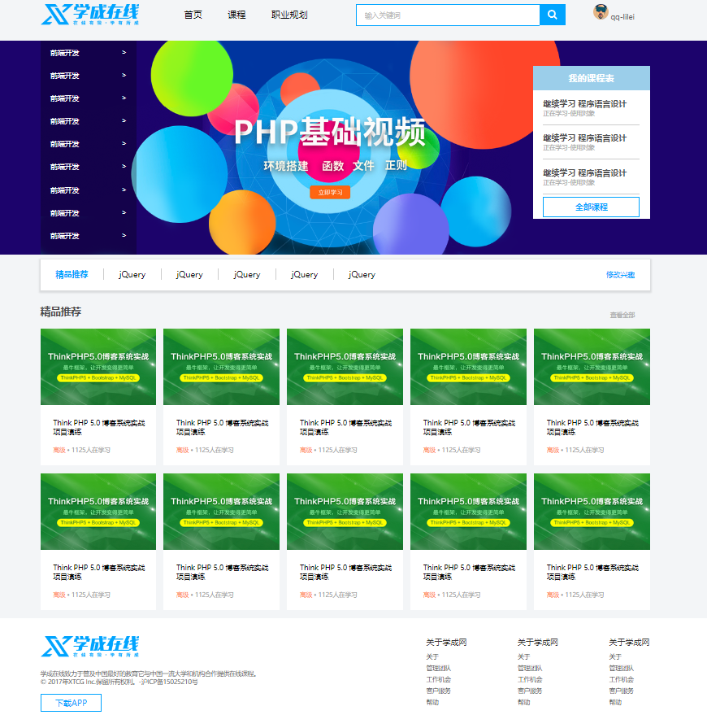
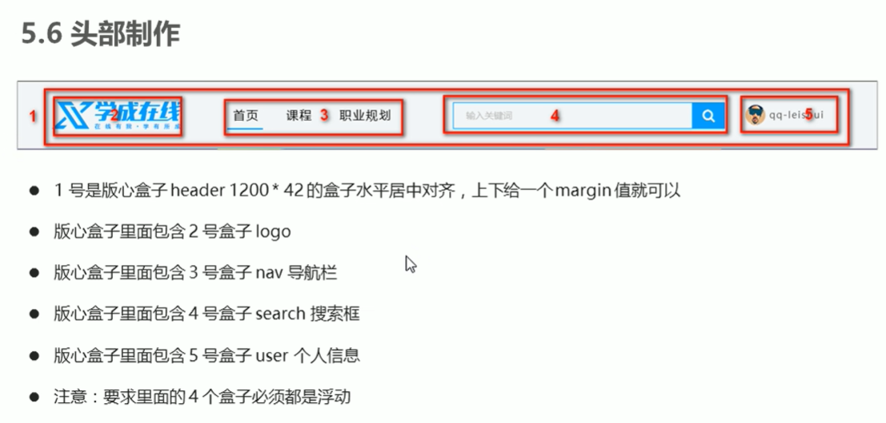

CSS样式：专门用来"美化"html标签

CSS规则由两个主要部分构成：选择器 + 一条或多条声明

```css
/* 
	选择器{样式}，即 给谁改样式{改什么样式} 
	样式 -- 键:值;
	代码风格：选择器和'{'中间保持空格，属性值前面和'：'后面保持空格
*/

h1 { color: red;  font-size: 25px; }
```

选择器：根据不同需求把不同的标签选出来

## 1.CSS选择器

**基础选择器**

- **id选择器（用于唯一性的元素上）**

  ```css
  #c1 {
     
  }
  
  <div id='c1'></div>
  ```

- **类选择器（常用）**

  一个标签可以有多个类，一个类可以被多个标签使用；id是某个标签专属的，唯一指定
  
  ```css
  .red {
      color: red;
  }
  .green {
      color: green;
  }
  .font35 {
  	font-size: 35px;
  }
  
  <div class='red font35'>变红色</div>
  <div class='green font35'>变绿色</div>
  /* 多类名_降低耦合度，减少代码量，方便修改 */
  ```

- **标签选择器（常用）**

  ```css
  div {
      color: pink;
  }
  
  <div>xxx</div>
  ```

- 通配符选择器

  ```css
  * {
  	padding: 0;
  	margin: 0;
  }
  /* 无需调用，会自动给所有的元素使用样式。特殊情况才用 */
  ```


**复合选择器：多个基础选择器复合而成**

- **属性选择器**

  ```css
  input[type='text'] {
  	border: 1px solid red;
  }
  .v1[xx="999"] {
  	color: gold;
  }
  
  <input type="text">
  <div class="v1" xx="999">a</div>
  ```

- **后代选择器（常用）**

  ```css
  ul li { 样式声明 }	/* 选择ul里面所有的 li标签元素。 */
  ol li a { ... }		/* 包含在内的都可以是后代，选中所有后代 */
  .nav li a { ... }
  ```

- **子选择器（子元素选择器）**

  ```css
  /* 只能选择某元素最近一级子元素，即亲儿子元素 */
  .nav > a { ... }		// 只会选择下一级的a，再下一级的不会选中
  ```

- **并集选择器**

  ```css
  /* 
  	选择要同时修改为相同样式的多组标签,即集体声明
  	约定语法规范：并集选择器喜欢竖着写
  */
  div,
  p,
  .pig li {
  	color: pink;
  }
  ```

- **伪类选择器**

  ```css
  /* 
  	用于向某些选择器添加特殊的效果，例如给链接添加特殊效果，例如选择第1个或第n个元素
  */
  	
  # 1.链接伪类选择器
  a:link		/* 选择所有未被访问的链接 */
  a:visited	/* 选择所有已被访问的链接 */
  a:hover		/* 选择鼠标指针位于其上的链接 */
  a:active	/* 选择活动链接（鼠标按下未弹起的链接） */
  
  /* 
  	要按照LVHA的顺序声明
  	要给<a>修改样式需要给a单独指定样式
  */
  
  # 2.:focus伪类选择器
  /* 获取获得焦点的表单元素，一般input类表单元素才能获取 */
  input:focus {
      background-color: pink;
      color: red;
  }
  
  # 3.:checked伪类选择器
  /* 修改被选中的复选框的样式 */
  ```

**注意：不同选择器有优先级，复合选择器的权重会叠加，具体可查看8.CSS三大特性**

## 2.字体属性 font系列

```css
body {
    font-style: normal;		/* italic为倾斜效果，少用。一般用来把em、i的倾斜字体变得不倾斜 */
    font-weight: 700;	/*字体粗细,更提倡用数字，也可用normal=400、bold=700、bolder、lighter*/ 
    font-size: 16px;	/*字体大小,16px为chrome默认字体大小*/ 
    font-family: 'Microsoft YaHei', Arial, Helvetica, sans-serif;
    /* 
    尽量使用系统默认自带字体，保证任何用户的浏览器中都能正确显示 
    显示微软雅黑字体。当用户电脑没有微软雅黑时，查看是否有下一个字体 Arial
    */
}
```

font复合属性写法：

```css
/* 基本格式： */
body {
	font: font-style font-weight font-size/line-height font-family;
}
/* 举例： */
body {
    font: italic 700 16px/20px 'Microsoft YaHei';
}

/* 不需要的属性可以省略，但必须保留font-size和font-family */
```

## 3.文本属性

文字对齐

```css
div {
	color: #00FF7F;		/*预定义的颜色red,green、十六进制：#FF6600,#00FF7F、RGB代码：rgb(255,0,0)*/
    text-align: center;		/* 水平对齐文本：left(默认)、right、center */ 
    text-decoration: none;	/*装饰文本。underline：下划线、none：字体取消下划线，例如<a>的*/ 
    text-indent: 2em;		/* 文本缩进。通常将段落的首行缩进，除此之外其他场合不太适合用 */
    line-height: 26px;		/* 文字行间距=上间距+文本高度+下间距，改的是上下间距 */
}

/* 案例：day3-22 新闻页面 */
```

**em**是一个相对单位，就是当前元素(font-size)1个文字的大小。若当前元素没有设置大小，则会按照父元素的1个文字大小

**文字垂直居中小技巧**：让文字的行高等于盒子的高度，即line-height = height = ??px；上下间距+文字刚好填满盒子，于是文字就居中了

```css
# 示例1
div {
    width: 230px;
    height: 40px;
    font-size: 10px;
    line-height: 30px;
}
在这个示例中：
- font-size 设置为 10px，表示文字的高度为 10px。
- line-height 设置为 30px，表示行高为 30px。

计算：
- 行高为 30px，减去文字高度 10px，剩余 20px。
- 默认情况下，行高会均匀地分配到文字的上下两侧，因此上下各 10px。
- 因为 div 的高度为 40px：

- div 高度 40px，减去行高 30px，剩余 10px。
- 这 10px 没有被行高占据，所以文字会偏上。


```


```css
# 示例2
div {
    width: 230px;
    height: 40px;
    font-size: 10px;
    line-height: 60px;
}
在这个示例中：
- font-size 设置为 10px，表示文字的高度为 10px。
- line-height 设置为 60px，表示行高为 60px。

计算：
- 行高为 60px，减去文字高度 10px，剩余 50px。
- 默认情况下，行高会均匀地分配到文字的上下两侧，因此上下各 25px。
- 因为 div 的高度为 40px：

- 上边 25px 加上文字高度 10px 等于 35px，比 div 高度 40px 低，文字会偏下。
```

**总结**

- 当行高 (line-height) 小于盒子高度 (height) 时，文字会偏上。

- 当行高 (line-height) 大于盒子高度 (height) 时，文字会偏下。

- 默认上下间距相等，若`line-height < height`，则**文字偏上**；若`line-height > height`，则**文字偏下**。

## 4.**CSS引入方式**

- 行内样式表（行内式）：就在标签上改

  ```html
  
  <div style="color:red;">中国联通</div>
  ```

- 内部样式表（嵌入式）：写到html页面内部。即将所有CSS代码单独放到 `<style>` 标签中。

  ```html
  <head>
      <style>
          .c1{
              color:red;
          }
      </style>
  </head>
  <body>
  <h1 class='c1'>中国联通</h1>
  <h1 class='c1'>中国移动</h1>
  </body>
  
  /* <style>标签一般放在<head>中 */
  ```

- 外部样式表（链接式）：单独写到CSS文件中，再把CSS文件引入到HTML页面中使用

  ```html
  <head>
      <link rel="stylesheet" href="/static/common.css">
  </head>
  <body>
  <h1 class='c1'>中国联通</h1>
  <h1 class='c1'>中国移动</h1>
  </body>
  ```

  ```css
  // common.css
  .c1{
      height:100px;
  }
  .c1{
      color:red;
  }
  ```

  **多重样式优先级：行内 > 内部 > 外部 > 默认**


## 5.元素显示模式

HTML元素一般分为块元素和行内元素

- 块元素：
  - `<div>`、`<h1>`--`<h6>`、`<p>`、`<ul>`、`<ol>`、`<li>`等等
  - 独占一行
  - 高宽、内外边距都可以控制
  - 宽度默认是容器（父级容器）的100%
  - 是一个容器及盒子，里面可以放行内或者块级元素
  - 文字类的元素如`<p>`、`<h1>`~`<h6>`内部不能再放块级元素
- 行内元素（内联元素）：
  - `<span>`、文本格式化标签（`<a>`、`<strong>`、`<b>`、`<em>`、`<i>`、`<del>`、`<s>`、`<ins>`、`<u>`）、等等
  - 相邻的行内元素在一行上，一行可以显示多个
  - 高宽设置无效（可以间接设置）
  - 默认宽度是它本身内容的宽度
  - 行内元素只能容纳文本或其他行内元素
  - 链接`<a>`里面不能再放链接，特殊情况`<a>`里面可以放块级元素，但是给`<a>`转换成块级模式最安全
- 行内块元素：
  - 在行内元素中的几个特殊的标签——``、`<input />`、`<td>`,他们同时具有块元素和行内元素的特点
  - 和相邻行内元素（行内块）在一行上，一行可以显示多个（行内元素特点）。**但它们之间有空白缝隙，可以通过浮动来解决。**
  - 默认宽度是它本身内容的宽度（行内元素特点）
  - 高、行高、内外边距都可以控制（块级元素特点）


## 6.元素显示模式转换

一个模式的元素需要另外一种模式的特性，需要用到display

```markdown
/* 把行内元素转换成块级元素 */
a {
	display: block;
    width: 150px;
    height: 50px;
    background-color: pink;
}

<a href="#">块级a元素</a>
<a href="#">块级a元素</a>
```

```markdown
/* 把块级元素转换成行内元素 */
div {
	display: inline;
    width: 300;
    height: 100px;
    background-color: purple;  
}

<div>行内的块级元素</div>
<div>行内的块级元素</div>
```

**display**

```css
display: inline;		- 块级 --> 行内
display: block;			- 行内 --> 块级
display: inline-block;	- 块/行--> 行内块

display:hidden;			- 隐藏 --> 隐藏但占用空间
display: none;			- 隐藏 --> 隐藏且不占用空间
```

案例：day5-18 简单小米侧边栏

```css
<style>
        /* 1. 把a转换为块级元素 */
        a {
            display: block;
            width: 230px;
            height: 40px;
            background-color: #55585a;
            font-size: 14px;
            color: #fff;
            text-decoration: none;
            text-indent: 2em;
            line-height: 40px;
        }

        /* 2 鼠标经过链接变换背景颜色 */
        a:hover {
            background-color: #ff6700;
        }
    </style>
```

```html
<body>
    <a href="#">手机 电话卡</a>
    <a href="#">电视 盒子</a>
    <a href="#">笔记本 平板</a>
    <a href="#">出行 穿戴</a>
    <a href="#">智能 路由器</a>
    <a href="#">健康 儿童</a>
    <a href="#">耳机 音响</a>
</body>
```


## 7.CSS的背景

```css
div {
    /* background-color: transparent;	透明色，也是默认颜色。背景颜色在背景图片下面 */
    background-color: pink;
    
    background-image: none | url("url");		/* 背景图片，none是默认值 */
    
    background-repeat: repeat | no-repeat | repeat-x | repeat-y;	/* 背景平铺，默认是平铺的 */

    background-attachment: scroll | fixed;	/* 背景图像固定（背景附着）：固定或随对象内容一起滚动 */
    
    background-position: x y; 
    /*
    	改背景图片位置,可为方位名词(top bottom left right center)或精确方位
    	若用方位名词，x y或y x一样的，若用px则不可颠倒
    	若只指定一个方位名词，另一个省略，则它默认为center；
    	若只指定一个精确名词，另一个省略，则一定x精确，y为center；
    	若混合使用，则x y也不可颠倒
    */
    background-size: auto | 宽 高 | 百分比 | cover | contain;
    /* 背景图片大小，auto默认不改变图片大小，宽高用px，cover等比例填满容器，contain等比缩放至紧贴容器边缘 */	
}

/* 案例：
	day4-26 五彩导航
	day4-19~20 背景位置-方位名词应用
*/
```

background复合写法

```css
div {
    background: color image repeat attachment position;
}

div {
	background: black url("images/bg.jpg") no-repeat fixed center top;
}
```

**背景色**半透明

```css
background： rgba(0, 0, 0, .3);

/* 	(0, 0, 0)表示黑色
	最后一个参数是alpha透明度，取值范围：0~1 ，越小越透明
*/
```

## 8.CSS三大特性

**1.层叠性**

用同一类选择器给某元素多次修改同一个样式（但不同值），此时下一个样式就会覆盖（层叠）上一个冲突的样式

```css
/*多样式&覆盖问题*/
.c1 {
    color: red!important;		<!-- 表示不会被覆盖-->
    border: 1px solid red;
}
.c1 {
	font-size: 28px;
    color: green;
}

<div class="c2 c1">
	不重名则样式不冲突，新样式会叠加进去；重名则样式冲突，按离结构就近原则,后来居上进行覆盖
</div>
```

2.**继承性**

子标签会继承父标签的**某些样式**，例如`text-`、`font-`、`line-`、`color`

恰当地使用继承可以简化代码，降低CSS样式的复杂性

```markdown
div {
    color: pink;
    font-size: 14px;
}
<div>
    <p>龙生龙，凤生凤，老鼠生的孩子会打洞</p>
</div>
```

--**行高的继承**

行高不仅可以是精确值，还可以是倍数。子标签先继承父标签的font，当子标签的font-size覆盖之后，line-height也会按倍数自动改变

```css
body {
    color: pink;
    /* font: 12px/24px 'Microsoft YaHei'; */
    font: 12px/1.5 'Microsoft YaHei';
}
div {
    /* 子元素继承了父元素 body 的行高 1.5 */
    /* 这个1.5 就是当前元素文字大小 font-size 的1.5倍   所以当前div 的行高就是21像素 */
    font-size: 14px; 
}
p {
    /* 1.5 * 16 =  24 当前的行高 */
    font-size: 16px;
}
/* li 么有手动指定文字大小  则会继承父亲的 文字大小  body 12px 所以 li 的文字大小为 12px 

当前li 的行高就是  12 * 1.5  =  18
*/
```

```html
<div>粉红色的回忆</div>
<p>粉红色的回忆</p>
<ul>
<li>我没有指定文字大小</li>
</ul>
```

**3.选择器优先级**

当同一个元素指定多个选择器，会产生优先级

- 选择器相同，则执行层叠性
- 选择器不同，则根据选择器权重执行

| 选择器               | 选择器权重 |
| -------------------- | ---------- |
| 继承 / *             | 0, 0, 0, 0 |
| 标签选择器           | 0, 0, 0, 1 |
| 类选择器，伪类选择器 | 0, 0, 1, 0 |
| ID选择器             | 0, 1, 0, 0 |
| 行内样式 style=""    | 1, 0, 0, 0 |
| !important 重要的    | ∞          |

**注意！**

**继承的权重是0**。如果给自己写了样式，那么将会覆盖继承的样式

`<a>`链接浏览器默认制定了一个样式 蓝色的 有下划线  `a {color: blue;}`。因此**`<a>`也不会使用继承的样式**，需要专门为他编写样式。


**CSS复合选择器权重的叠加**

```css
<style>
    /* 复合选择器会有权重叠加的问题 */
    /* 权重虽然会叠加,但是永远不会有进位 */
    /* ul li 权重  0,0,0,1 + 0,0,0,1  =  0,0,0,2     2 */
    ul li {
    	color: green;
    }
    /* li 的权重是 0,0,0,1    1 */
    li {
    	color: red;
    }
    /* .nav li 权重  0,0,1,0  +  0,0,0,1  =  0,0,1,1    11 */
    .nav li {
    	color: pink;
    }
</style>

<body>
    <ul class="nav">
        <li>大猪蹄子</li>
        <li>大肘子</li>
        <li>猪尾巴</li>
    </ul>
</body>

练习：
div ul li 	-->	0,0,0,3
.nav ul li	-->	0,0,1,2
a:hover		-->	0,0,1,1
.nav a		-->	0,0,1,1
```

页面布局三大核心：盒子模型、浮动、定位

网页布局过程：		（其实就是利用CSS摆盒子）

1. 先准备好相关的网页元素，基本都是盒子Box
2. 利用CSS设置好盒子样式，然后摆放到相应位置
3. 往盒子里面装内容

## 9.盒子模型★★★

一个盒子分为四个部分：边框`border`、内边距`padding`、外边距`margin`、内容`content`

每个部分又可以分别分为`top`、`right`、`bottom`、`left`四条边

为盒子设置大小，实际上是content的大小，border和padding会在外撑大盒子，margin会使盒子有间距

### **9.1 边框 border**

```css
border: border-witdth | border-style | border-color

div {
    width: 300px;
    height: 200px;
    /* border-width 边框的粗细  一般情况下都用 px */
    border-width: 5px;
    /* border-style 边框的样式  solid 实线边框   dashed 虚线边框  dotted 点线边框*/
    border-style: solid;
    border-color: pink;
    
}

border: 5px solid pink;
border-top: 5px solid pink;
border-bottom-color: purple transparent;

/* 合并相邻单元格的边框（table中） */
border-collapse: collapse;

/* border会撑大盒子实际大小,若要一个200*200的盒子，但是border-width: 10px;则盒子宽高要减去边框大小10px*2 */
/* 案例：day5-12 细线表格今日小说排行榜 */
```

### **9.2 内边距 padding**

```css
/* 内边距padding用来设置边框border和内容content之间的距离 */

/* 内边距复合写法 */
padding: 5px;			/* 上右下左 */
padding: 5px 10px;		/* 上下、左右 */
padding: 5px 10px 20px;	/* 上、左右、下 */
padding: 5px 10px 20px 30px;/* 上右下左  */

/* padding会撑大盒子实际大小，若要求盒子跟效果图的大小要保持一致，则让width/height减去多出来的padding */

/* 
	-- 利用padding撑开盒子的特性，设置顶部导航栏时，根据字数不同盒子大小也会相应长一点短一点（一样长不美观） 
	-- 案例：day5-17 padding应用-新浪导航
*/
```

```css
/* 	-- 但是如果盒子没有指定width/height属性，则此时padding不会撑开盒子大小
	-- 如果父元素指定宽高，子元素不指定，使用padding时不会撑开盒子。但若子元素也设置宽高，则可能超出父元素
*/
h1 {
    /* width: 100%; */
    height: 200px;
    background-color: pink;
    padding: 30px;
}
div {
    width: 300px;
    height: 100px;
    background-color: purple;
}
div p {
    /* width: 100%; */
    padding: 30px;
    background-color: skyblue;
}

<h1></h1>
<div>
	<p></p>	
</div>
```

案例day5-17：新浪导航

```css
<style>
    .nav {
        height: 41px;
        border-top: 3px solid #ff8500;
        border-bottom: 1px solid #edeef0;
        background-color: #fcfcfc;
        line-height: 41px;
    }
    .nav a {
        /* a属于行内元素 此时必须要转换 行内块元素 */
        display: inline-block;
        height: 41px;
        padding: 0 20px;
        font-size: 12px;
        color: #4c4c4c;
        text-decoration: none;
    }
    .nav a:hover {
        background-color: #eee;
        color: #ff8500;
    }
</style>
```

```html
<body>
    <div class="nav">
        <a href="#">新浪导航</a>
        <a href="#">手机新浪网</a>
        <a href="#">移动客户端</a>
        <a href="#">微博</a>
        <a href="#">三个字</a>
    </div>
</body>
```

### **9.3 外边距 margin**

```css
/* margin 控制盒子和盒子之间的距离 */

/* 外边距复合写法 */
margin: 5px;			/* 上右下左 */
margin: 5px 10px;		/* 上下、左右 */
margin: 5px 10px 20px;	/* 上、左右、下 */
margin: 5px 10px 20px 30px;/* 上右下左  */
```

块级盒子**水平居中**：盒子有width + 左右margin为auto。`margin: 0 auto;`

行内元素、行内块元素**水平居中**：给其父元素添加`text-align: center;`即可

**相邻块元素垂直外边距的合并**：当上面的块元素有下外边距，相邻的下面的块元素有上外边距，则它们的垂直间距不是margin-bottom + margin-top，而是取`max(margin-bottom, margin-top)`，因此**上下相邻尽量只给一个盒子添加margin值**。


**嵌套块元素垂直外边距的塌陷**：对于两个嵌套关系（父子关系）的块元素，父元素有上外边距的同时子元素也有上外边距，此时父元素会陷较大的外边距值

-- 解决方案：

- 为父元素定义上边框

- 为父元素定义上内边距

- 为父元素添加`overflow: hidden;`

- 其他方法：浮动、固定、绝对定位等后面学到

```css
.father {
    width: 400px;
    height: 400px;
    background-color: purple;
    margin-top: 50px;
    /* border: 1px solid red; */
    /* border: 1px solid transparent; */
    /* padding: 1px; */
    
    overflow: hidden;
    /*  隐藏超出部分的内容
		清除浮动
		解决外边距塌陷 */
}
.son {
    width: 200px;
    height: 200px;
    background-color: pink;
    margin-top: 100px;
}

<div class="father">
	<div class="son"></div>
</div>
```

--总结：

- 两个相邻的元素，只要有一个浮动，就不会有外边距的问题

- 父子盒子只要有一个浮动，就不会发生塌陷

**清除内外边距**

网页元素很多都自带默认内外边距，且不同浏览器默认值也不同，因此**在布局前，要清除下网页元素内外边距**

1.body 标签默认有个外边距（白色间隙），无法铺满网页。例如：chrome是8px外边距。

2.ul有40px默认内边距 等等

```css
* {
    padding: 0;	/* 清除内边距 */
	margin: 0;	/* 清除外边距 */
}
```

此外，**行内元素为了照顾兼容性，尽量只设置左右内外边距**，不设置上下内外边距(设置了也不起作用)。但是转换为块级和行内块元素就可以设置了

### 综合案例：产品卡片模块 ★★★

来自材料 day 5-26


```css
<style>
* {
    margin: 0;
    padding: 0;
}
body {
    background-color: #f5f5f5;
}
a {
    color: #333;
    text-decoration: none;
}
.box {
    width: 298px;
    height: 415px;
    background-color:#fff;
    /* 让块级的盒子水平居中对齐 */
    margin: 100px auto;
}
.box img {
    /* 图片的宽度和父亲一样宽 */
    width: 100%;
}
.review {
    height: 70px;
    font-size: 14px;
    /* 因为这个段落没有 width属性 所有 padding不会撑开盒子的宽度 */
    padding: 0 28px;
    margin-top: 30px;
}
.appraise {
    font-size: 12px;
    color: #b0b0b0;
    margin-top: 20px;
    padding: 0 28px;
}
.info {
    font-size: 14px;
    margin-top: 15px;
    padding: 0 28px;
}
.info h4 {
    display: inline-block;
    font-weight: 400;

}
.info span {
    color: #ff6700;    
}
.info em {
    font-style: normal;
    color: #ebe4e0;
    margin: 0 6px 0 15px;
}
</style>
```

```html
<body>
    <div class="box">
        
        <p class="review">快递牛，整体不错蓝牙可以说秒连。红米给力</p>
        <div class="appraise">来自于 117384232 的评价</div>
        <div class="info">
               <h4> <a href="#">Redmi AirDots真无线蓝...</a></h4>
               <em>|</em>
               <span> 99.9元</span>
        </div>
    </div>
</body>
```

### 综合案例：新闻快报

来自材料 day 6-1

```css
<style>
    * {
        margin: 0;
        padding: 0;
     }
    li {
        /* 去掉li前面的小圆点 */
        list-style: none;
    }
    .box {
        width: 248px;
        height: 163px;
        border: 1px solid #ccc;
        margin: 100px auto;
    }
    .box h3 {
        height: 32px;
        border-bottom: 1px dotted #ccc;
        font-size: 14px;
        font-weight: 400;
        line-height: 32px;
        padding-left: 15px;
    }
    .box ul li a {
        font-size: 12px;
        color: #666;
        text-decoration: none;
    }
    .box ul li a:hover {
        text-decoration: underline;
    }
    .box ul li {
        height: 23px;
        line-height: 23px;
        padding-left: 20px;
    }
    .box ul {
        margin-top: 7px;
    }
</style>
```

```html
<body>
    <div class="box">
        <h3>品优购快报</h3>
        <ul>
            <li><a href="#">【特惠】爆款耳机5折秒！</a></li>
            <li><a href="#">【特惠】国庆节，健康好礼低至5折！</a></li>
            <li><a href="#">【特惠】爆款耳机5折秒！</a></li>
            <li><a href="#">【特惠】9.9元洗100张照片！</a></li>
            <li><a href="#">【特惠】长虹智能空调立省1000</a></li>
        </ul>

    </div>
</body>
```

### 圆角边框—CSS3新增

```css
/* 设置外边框圆角: (椭)圆与边框的交集形成圆角效果 */
width: 300px;
height: 100px;
border-radius: 100px;		/* 做圆角矩形，就先做矩形盒子，圆角设为高度的一半 */

border-radius: 50%;		/* 做圆形，就先做正方形盒子，圆角设为宽高的一半 */

简写：
border-raduis: 左上右下 右上左下;
border-radius: 左上 右上左下 右下 ;
border-radius: 左上 右上 右下 左下;

border-top-left-radius: 20px;
border-bottom-right-radius: 20px;
```

### 盒子阴影—CSS3新增

```css
/* 设置盒子阴影，为盒子添加阴影效果，阴影不会占用空间 */
box-shadow: h-shadow v-shadow blur spread color inset;

h-shadow	必需，阴影的水平位置，允许负值
v-shadow	必需，阴影的垂直位置，允许负值
blur 		模糊距离，让影子更模糊
spread 		阴影的尺寸，即大小
color 		阴影的颜色
inset		将外部阴影(outset)改为内部阴影（内凹）

div:hover {
    box-shadow: 10px 10px 10px -4px rgba(0, 0, 0, .3);	/* outset是默认的，不用写，再写会失效 */
}
```

### 文字阴影(了解)

```css
text-shadow: h-shadow v-shadow blur color;
text-shadow: 5px 5px 6px rgba(0, 0, 0, .3);
```


## 10.float(浮动)★★★

为什么需要浮动：

- 当要让div排列在同一行时，转换为行内块会有默认间隙，但是有时候网页的div之间间隙多大是严格要求的

- 有时候需要实现两个盒子在网页两侧的水平左右对齐

——有很多网页布局效果标准流无法完成，此时可以利用浮动完成布局：**浮动可以改变元素标签默认的排列方式**

网页布局第一准则：多个块级元素纵向排列找标准流，横向排列找浮动

```markdown
# float：用于创建浮动框，将其移动到一边，知道左边缘或右边缘触及包含块或另一个浮动框的边缘

float: none | left | right;
```

### 浮动特性

**1.脱标** 

-  浮动元素会**脱离标准流的控制**，(浮)移动到指定位置（**后面的**标准流元素会重新排列，前顶并占据空出来的位置）
-  浮动的盒子不再保留原先的位置

**2.浮动元素一行显示**

- 若多个盒子都设置了浮动，则它们会**按照属性值一行内显示并且顶端对齐顺序排列**
- 如果父元素装不下它们，多出的盒子会另起一行对齐

**3.浮动元素具有行内块特性**

- 任何元素都能浮动，浮动后会具有行内块元素的特性
- 若行内元素有了浮动，则不需要转换为块级/行内块元素  就可以直接给高度和宽度
- 若块级盒子没有设置宽度，则默认宽度和父级一样宽。但是添加浮动后，它的宽度根据内容来定
- 浮动的盒子中间没有缝隙，是紧挨着一起的
- 浮动的盒子不会有外边距合并的问题


**浮动元素经常和标准流父级搭配使用**

为了约束浮动元素位置，网页布局一般采取的策略是：

先用标准流的父元素排列上下位置，然后内部子元素采取浮动排列左右位置，符合网页布局第一准则

注意：浮动进行排列时注意权重问题，有时候权重不够会导致设置无效	

### 案例：浮动布局练习

来自材料 day 6-13 

```css
<style>
    .box {
        width: 1226px;
        height: 615px;
        background-color: pink;
        margin: 0 auto;
    }

    .left {
        float: left;
        width: 234px;
        height: 615px;
        background-color: purple;
    }

    .right {
        float: left;
        width: 992px;
        height: 615px;
        background-color: skyblue;
    }

    .right>div {
        float: left;
        width: 234px;
        height: 300px;
        background-color: pink;
        margin-left: 14px;
        margin-bottom: 14px;
    }
</style>
```

```html
<div class="box">
    <div class="left">左青龙</div>
    <div class="right">
        <div>1</div>
        <div>2</div>
        <div>3</div>
        <div>4</div>
        <div>5</div>
        <div>6</div>
        <div>7</div>
        <div>8</div>
    </div>
</div>
```

**浮动子元素脱离了文档流，不会撑起父元素，更别说父元素也浮动了。他们都脱离了标准流的控制**

此外，**高度无论何时都不会继承，自己设置或者不设置仅靠内容撑开**

```css
/* 案例6-14 常见网络布局 代码 */
<style>
    * {
        margin: 0;
        padding: 0;
    }

    li {
        list-style: none;
    }

    .top {
        height: 50px;
        background-color: gray;
    }

    .banner {
        width: 980px;
        height: 150px;
        background-color: gray;
        margin: 10px auto;
    }

    .box {
        width: 980px;
        margin: 0 auto;
        height: 300px;
        background-color: pink;
    }

    .box li {
        float: left;
        width: 237px;
        height: 300px;
        background-color: gray;
        margin-right: 10px;
    }

    .box .last {
        margin-right: 0;
    }

    /* 只要是通栏的盒子(和浏览器一样宽) 不需要指定宽度 */
    .footer {
        height: 200px;
        background-color: gray;
        margin-top: 10px;
    }
</style>

<body>
    <div class="top">top</div>
    <div class="banner">banner</div>
    <div class="box">
        <ul>
            <li>1</li>
            <li>2</li>
            <li>3</li>
            <li class="last">4</li>
        </ul>
    </div>
    <div class="footer">footer</div>
</body>
```

重点课程：21节--浮动的两个注意点

**注意：**

1. **浮动和标准流的父盒子搭配**
   - 先用标准流的父元素排列上下位置，之后内部子元素采取浮动排列左右位置
2. **一个盒子浮动了，理论上其余的兄弟元素也要浮动**
   - 浮动之后是自己的位置被后面的标准流元素占用，而浮动元素在原地飘。即浮动元素覆盖住后面顶上来的标准流，不会影响前面的标准流

### 清除浮动（4种）

给父盒子高度会有以下问题：

- 父盒子里面可能有非常多元素，不方便定高度
- 有时候父盒子里面不知道给多高，随时变化的，例如：新闻内容有的长有的短

因此，我们可以不给父盒子高度，由孩子来决定高度，由子盒子来撑开。但也会遇到问题：

- 如果给子盒子添加浮动，它们确实会排列在一行里，但父盒子将会没有高度 值为0，若再来一个标准流子盒子，将会被前面的子盒子覆盖

**为了能不给父盒子具体高度，还不会遇到浮动导致的问题，我们需要清除浮动**

**本质：清楚浮动元素脱离标准流造成的影响**

------

清除浮动后，父盒子就会根据浮动的子盒子自动检测高度。父盒子有了高度，就不会影响下面的标准流

```css
/* 清除浮动策略：闭合浮动 */
/* 实际中只用both */
clear: left | right | both;
```

**1.额外标签法(了解)**

可以在最后一个浮动子元素后面额外添加一个块级标签，用 【clear属性】来清除浮动，从而撑起父亲。

```css
<style>...</style>
<div class="box">
	<div class="item"></div>
	<div class="item"></div>
    <div class="item"></div>
    <div class="item"></div>
    <div class="item"></div>
	<div style="clear: both; "></div>
    /* clear: 某侧不允许浮动，both两侧，none允许（默认值），left、right */
</div>

优点：书写方便
缺点：添加许多无意义的标签，结构化差
```

**2.给父级添加overflow属性**

```css
父级 {
	overflow: hidden;
}

优点：代码简介
缺点：无法显示溢出的部分
```

**3.给父级添加after伪元素**

```css
/* :after 伪元素清除，是额外标签法的升级版 */
.clearfix:after{
	content: "";
	display: block;
    height: 0;
	clear: both;
    visibility: hidden;
}
.clearfix {		/* IE6、7专有 */
    *zoom: 1;
}

优点：没有增加标签，结构更简单
缺点：需要照顾低版本浏览器
```

**4.给父级添加双伪元素（常用）**

```css
/* 双伪元素清除 */

<某标签....class="clearfix"....>

.clearfix:before,
.clearfix:after {
	content: "";
    display: table;
}
.clearfix:after {
    clear: both;
}
.clearfix {		/* IE6、7专有 */
    *zoom: 1;
}
优点：代码更更简洁
缺点：需要照顾低版本浏览器
```

## 补充：CSS属性书写顺序

1. 布局定位属性：display、position、float、clear、visibility、overflow(建议display第一个写)
2. 自身属性：width、height、margin、padding、border、background
3. 文本属性：color、font、text-decoration、text-align、vertical-align、white-space、break-word
4. 其他属性(CSS3)：content、cursor、border-radius、box-shadow、text-shadow、background:linear-gradient...

```css
.jdc {
	display: block;
	position: relative;
	float: left;
	
	width: 100px
	height: 100px;
	margin: 0 10px;
	padding: 20px 0;
	
	font-family: Arial, 'Helvetica Neue', Helvetica, sans-serif;
	color: #333;
	
	background: rgba(0, 0, 0, .5);
	border-radius: 10px;
}
```


## 11.大案例：学成在线首页（待补充）★★★★

来自材料的 day 7 ：代码+工具软件压缩包

准备材料：学成在线PSD源文件、PS、VSCode、Chrome

P119 开始—— 学习如何使用PS进行切图、用像素大厨代替PS也行



>  页面布局整体思路

1. 必须确定页面的版心（可视区），测量可得知
2. 分析页面中的行模块，以及每个行模块中的列模块。即页面布局第一准则
3. 一行中的列模块经常浮动布局，先确定每个列的大小，之后确定列的位置。即页面布局第二准则
4. 制定HTML结构。遵循先有结构，后有样式的原则
5. 先理清楚布局结构，再写代码

版心

```css
.w {
    width: 1200px;
    margin: auto;
}
```

### 头部 header 区域



```html
<!-- 1.header 头部区域开始 -->
<div class="header w">
    <!-- 里面插入 logo nav search 和 user 模块 -->
</div>
<!-- 头部区域结束 -->
```

```css
.header {
	height: 42px;
	background-color: pink;
	/* 注意这里的margin会层叠.w里的margin	*/
	margin: 30px auto;
}
```

### 标志 logo区域

```html
<!-- logo 部分 -->
<div class="logo">
    
</div>
```

```css
.logo {
    width: 198px;
    height: 42px;
    background-color: purple
}
```

### 导航栏 nav 区域

- 实际开发中，导航栏用`li`+`a`来实现。如果直接用`<a>`，会被搜索引擎认为有堆砌关键字嫌疑（即故意堆砌关键字容易被搜索引擎降权），影响网站排名	
- 导航栏nav可以不给宽度，将来可以继续添加文字
- 导航栏里面文字不一样多，最好给`<a>`一个左右`padding`撑开盒子，而不是指定宽度

```html
<!-- 导航栏部分 nav -->
<div class="nav">
    <ul>
        <li><a href="#">首页</a></li>
        <li><a href="#">课程</a></li>
        <li><a href="#">职业规划</a></li>
    </ul>
</div>
```

```diff
.logo {
+++    float: left;
}

```

```css
li {
	list-style: none;
}
a {
    text-decoration: none;
}
.nav {
	float: left;	/* .logo和.nav都向左浮动*/	
	margin-left: 60px;
}
.nav ul li {
	float: left;
    margin: 0 15px;
}
.nav ul li a {
	display: block;
	height: 42px;
	padding: 0 10px;
	line-height: 42px;
	font-size: 18px;
	color: #050505;
}
.nav ul li a:hover {
	border-bottom: 2px solid #00a4ff;
	color: #00a4ff;
}
```

### 搜索栏 search 模块

- 一个 search 大盒子里面包含2个表单
- 注意搜索款和搜索按钮都是行内块元素，之间有一个很小的缝隙，父元素刚好装不下，按钮只能另起一行。所以可以给它们俩加上浮动

```html
<!-- 搜索模块 -->
<div class="search">
    <input type="text" value="输入关键词">
    <button></button>
</div>
```

```css
.search {
	float: left;
	width: 412px;
	height: 42px;
	background-color: skyblue;
	margin-left: 70px;
}
.search input {
	float: left;
	width: 345px;
	height: 40px;
	border: 1px solid #00a4ff;
	border-right: none;
	color: #bfbfbf;
	font-size: 14px;
	padding-left: 15px;
	/* 这里padding-left会撑大盒子，所以width要减去15px */
}
.search button {
	float: left;
	width: 50px;
	height: 42px;
	background: url(images/btn.png);
	/* button 默认有边框，需要手动去除	 */
	border: 0;
}
```

### 用户 user 模块

```html
<!-- 用户模块 -->
<div class="user">
    
    qq-lilei
</div>
```

```css
body {
	background-color: #f3f5f7;
}
.user {
	float: right;
	line-height: 42px;
	margin-right: 30px;
	font-size: 14px;
	color: #666;
}
```

然后可以把 `.header`、`.logo`、`.search` 的背景色都删了，这样页面 header 部分就完成了

补充：用户头像和用户昵称没有水平对齐，需要使用`vertical-align`参数来对齐

```html

```


### 横幅 banner 模块

### 侧边栏 subnav 模块

- 大盒子 banner 不给宽度，只给高度和一个背景色；版心盒子要水平居中对齐；左对齐 subnav 侧导航栏；右对齐 course 课程

```html
<!-- 2. banner 模块开始 -->
<div class="banner">
    <div class="w">
        <div class="subnav">
            <ul>
                <li><a href="#">前端开发 <span> &gt; </span></a></li>
                <li><a href="#">前端开发 <span> &gt; </span> </a></li>
                <li><a href="#">前端开发 <span> &gt; </span> </a></li>
                <li><a href="#">前端开发 <span> &gt; </span> </a></li>
                <li><a href="#">前端开发 <span> &gt; </span> </a></li>
                <li><a href="#">前端开发 <span> &gt; </span> </a></li>
                <li><a href="#">前端开发 <span> &gt; </span> </a></li>
                <li><a href="#">前端开发 <span> &gt; </span> </a></li>
                <li><a href="#">前端开发 <span> &gt; </span> </a></li>
            </ul>
        </div>
   		<!-- 这里编写 course 部分 -->     
    </div>
</div>
<!-- banner 模块结束 -->
```

```css
/* banner 区域  */
.banner {
	height: 421px;
	background-color: #1c036c;
}
.banner .w {
	height: 421px;
	background: url(images/banner2.png) no-repeat top center;
}
.subnav {
	width: 190px;
	height: 421px;
	background: rgba(0, 0, 0, 0.3);
}
.subnav ul li {
	height: 45px;
	line-height: 45px;
	padding: 0 20px;
}
.subnav ul li a {
	font-size: 14px;
	color: #fff;
}
.subnav ul li span {
	float: right;
}
.subnav ul li a:hover {
    color: #00a4ff;
}
```

### 课程表 course 模块

- 浮动的盒子不会有外边距合并的问题

```diff
.subnav {
+++		float: left;
}
```

```html
<!-- course 课程表模块 -->
<div class="course">
    <h2>我的课程表</h2>
    <div class="bd">
        <ul>
            <li>
                <h4>继续学习 程序语言设计</h4>
                <p>正在学习-使用对象</p>
            </li>
            <li>
                <h4>继续学习 程序语言设计</h4>
                <p>正在学习-使用对象</p>
            </li>
            <li>
                <h4>继续学习 程序语言设计</h4>
                <p>正在学习-使用对象</p>
            </li>
        </ul>

        <a href="#" class="more">全部课程</a>
    </div>
</div>
```

```css
.course {
    float: right;
    width: 230px;
    height: 300px;
    background-color: #fff;
    /* 浮动的盒子不会有外边距合并的问题 */
    margin-top: 50px;
}
.course h2 {
    height: 48px;
    background-color: #9bceea;
    text-align: center;
    line-height: 48px;
    font-size: 18px;
    color: #fff;
}
.bd {
    padding: 0 20px;
}
.bd ul li {
    padding: 14px 0;
    border-bottom: 1px solid #ccc;
}
.bd ul li h4 {
    font-size: 16px;
    color: #4e4e4e;
}
.bd ul li p {
    font-size: 12px;
    color: #a5a5a5;
}
.bd .more {
    display: block;
    height: 38px;
    border: 1px solid #00a4ff;
    margin-top: 5px;
    text-align: center;
    line-height: 38px;
    color: #00a4ff;
    font-size: 16px;
    font-weight: 700;
}
```

### 精品推荐横条模块

- 大盒子水平居中 goods 精品，注意这里有个盒子阴影
- 左侧盒子是H3左侧浮动
- 中间盒子放链接左侧浮动，goods-item 距离可以控制链接的左右外边距（注意行内元素只给左右内外边距）
- 右侧盒子右浮动 mod 修改

```html
<!-- 3.精品推荐模块开始 -->
<div class="goods w">
    <h3>精品推荐</h3>
    <ul>
        <li><a href="#">jQuery</a></li>
        <li><a href="#">jQuery</a></li>
        <li><a href="#">jQuery</a></li>
        <li><a href="#">jQuery</a></li>
        <li><a href="#">jQuery</a></li>
    </ul>
    <a href="#" class="mod">修改兴趣</a>
</div>
<!-- 精品推荐模块结束 -->
```


```css
/* 精品推荐模块 */
.goods {
    height: 60px;
    background-color: #fff;
    margin-top: 10px;
    box-shadow: 0 2px 3px 3px rgba(0,0,0, 0.1);
    /* 行高会继承， 会继承给3个孩子 */
    line-height: 60px;
}
.goods h3 {
    float: left;
    margin-left: 30px;
    font-size: 16px;
    color: #00a4ff;
}
.goods ul {
    float: left;
    margin-left: 30px;
}
.goods ul li {
    float: left;
}
.goods ul li a {
    padding: 0 30px;
    font-size: 16px;
    color: #050505;
    border-left: 1px solid #ccc;
}
.mod {
    float: right;
    margin-right: 30px;
    font-size: 14px;
    color: #00a4ff;
}
```

### 精品推荐核心模块

- 大盒子版心水平居中对齐
- 上盒子 `box-hd` 里面左侧标题 h3 左浮动， 右侧链接 a 右浮动
- 下盒子 `box-bd` 里面是无序列表，有10个 li 组成

- 技巧：如果一行要装5个盒子但是宽度不够装，第五个到了下一行，**可以适当的加宽父元素**（因为第五个元素的右边距其实没颜色、看不到，在视觉上其实没变化）

```html
<div class="box w">
    <div class="box-hd">
        <h3>精品推荐</h3>
        <a href="#">查看全部</a>
    </div>
    <div class="box-bd">
        <ul>
            <li>
                
                <h4>
                    Think PHP 5.0 博客系统实战项目演练
                </h4>
                <div class="info">
                    <span>高级</span> • 1125人在学习
                </div>
            </li>
   			<!-- 这里再粘贴9个相同的li；后面js课程会学习怎么动态渲染li标签，不用重复粘贴 -->         
        </ul>
    </div>
</div>
```


```css
.box {
    margin-top: 30px;
}
.box-hd {
    height: 45px;
}
.box-hd h3 {
    float: left;
    font-size: 20px;
    color: #494949;
}
.box-hd a {
    float: right;
    font-size: 12px;
    color: #a5a5a5;
    margin-top: 10px;
    margin-right: 30px;
}   
/* 把li 的父亲ul 修改的足够宽一行能装开5个盒子就不会换行了 */
.box-bd ul {
    width: 1225px;
}
.box-bd ul li {
    float: left;
    width: 228px;
    height: 270px;
    background-color: #fff;
    margin-right: 15px;
    margin-bottom: 15px;
}
/*  限制图片不要超出li盒子的大小 */
.box-bd ul li img {
    width: 100%;
}
.box-bd ul li h4 {
    margin: 20px 20px 20px 25px;
    font-size: 14px;
    color: #050505;
    font-weight: 400;
}
.box-bd .info {
    margin: 0 20px 0 25px;
    font-size: 12px;
    color: #999;
}
.box-bd .info span {
    color: #ff7c2d;
}
```

**这里后面还有一个类似的模块，课程省略了，课后作业自己完成**

### 底部 footer 模块

```html
<!-- 5.footer 模块制作 -->
<div class="footer">
    <div class="w">这里面放copyright和links代码</div>
</div>
```

```css
.footer {
	height: 415px;
	background-color: pink;
}
```


- 编写 footer 盒子测试后发现会顶到上面去，因为`.box-bd ul li`是浮动的，并且父盒子为了具有延展性，没有设置高度。为了解决这个布局问题，需要给`li`的父盒子`ul`清除浮动。

```diff
<div class="box-bd">
---		<ul>
+++		<ul class="clearfix">
```


```css
.clearfix:before,.clearfix:after {
    content:"";
    display:table; 
}
.clearfix:after {
    clear:both;
}
.clearfix {
	*zoom:1;
}  
```

`footer` 模块里分为左对齐的版权`copyright`盒子和右对齐的链接组`links`盒子

### 版权 copyright 模块

```html
<div class="copyright">
    
    <p>学成在线致力于普及中国最好的教育它与中国一流大学和机构合作提供在线课程。<br>
        © 2017年XTCG Inc.保留所有权利。-沪ICP备15025210号</p>
    <a href="#" class="app">下载APP</a>
</div>
```

```css
.copyright {
	float: left;
}
.copyright p {
	font-size: 12px;
	color: #666;
	margin: 20px 0 15px 0;
}
.copyright .app {
    display: block;
    width: 118px;
    height: 33px;
    border: 1px solid #00a4ff;
    text-align: center;
    line-height: 33px;
    color: #00a4ff;
    font-size: 16px;
}
```

### 链接组 links 模块

- 链接组这里有3列，可以用自定义列表`dl dt dd`来实现，每个`dl`为一列，都需要左浮动并且给个外边距分隔开

```html
<div class="links">
    <dl>
        <dt>关于学成网</dt>
        <dd><a href="#">关于</a></dd>
        <dd><a href="#">管理团队</a></dd>
        <dd><a href="#">工作机会</a></dd>
        <dd><a href="#">客户服务</a></dd>
        <dd><a href="#">帮助</a></dd>
    </dl>
    <dl>
        <dt>关于学成网</dt>
        <dd><a href="#">关于</a></dd>
        <dd><a href="#">管理团队</a></dd>
        <dd><a href="#">工作机会</a></dd>
        <dd><a href="#">客户服务</a></dd>
        <dd><a href="#">帮助</a></dd>
    </dl>
    <dl>
        <dt>关于学成网</dt>
        <dd><a href="#">关于</a></dd>
        <dd><a href="#">管理团队</a></dd>
        <dd><a href="#">工作机会</a></dd>
        <dd><a href="#">客户服务</a></dd>
        <dd><a href="#">帮助</a></dd>
    </dl>
</div>
```

```css
.links {
    float: right;
}
.links dl {
    float: left;
    margin-left: 100px;
}
.links dl dt {
    font-size: 16px;
    color: #333;
    margin-bottom: 5px;
}
.links dl dd a {
    color: #333;
    font-size: 12px;
}
```

最后把`footer`颜色改回`#fff`即可。

到此为止，学成在线首页基本完成。其中还有一个模块为课后作业，需要自己完成。此外，hot小标签会在下一小节**定位**中学习。后面js课程还会学习如何通过JavaScript动态渲染卡片，而不要重复性的写死的html代码中。


### hot new 模块添加

> 涉及到定位的子绝父相知识

首先在HTML中添加角标图片的代码

```diff
<li>
+++    <em>
+++        
+++    </em>
    
    <h4>
        Think PHP 5.0 博客系统实战项目演练
    </h4>
    <div class="info">
        <span>高级</span> • 1125人在学习
    </div>
</li>
```

为了区别卡片图片和角标图片，可以用`li img`和`li > img`来区分

```diff
---.box-bd ul li img {
+++.box-bd ul li > img {
    width: 100%;
}
```

添加以下内容：

```css
.box-bd ul li em {
    position: absolute;
    top: 4px;
    right: -4px;
}
```

**子绝父相**，需要给`em`父盒子添加相对定位，不然角标图片会以浏览器为基准，出现在页面右上角

```diff
.box-bd ul li {
+++	position: relative;
}
```


## 12.定位★★★

某些场景标准流和浮动无法实现，但是定位可以

- 浮动可以让多个块级盒子一行没有缝隙排列显示，经常用于横向排列盒子
- 定位可以让盒子自由地在某个盒子内移动位置或者固定在屏幕中某个位置，并且可以压住其他盒子

**定位 = 定位模式 + 边偏移**

1.定位模式：制定一个元素在文档中的定位方式

2.边偏移：决定该元素的最终位置，`top bottom left right`四个属性，定义元素相对于它的父元素边线的距离/偏移量，这四个属性只有在定位里可以用


### **定位模式(5种)**

**1.1 静态定位 static(了解即可)**

- 元素默认的定位方式，即无定位

```
选择器 { position: static; }
```

- 按照标准流特性摆放位置（不脱标），它没有边偏移
- 在布局时很少用到


**1.2 相对定位 relative（重要）**

- 移动位置时**参照点是自己原来的位置**（不脱标，保留原位置）

```
选择器 { position: relative; }
```

- **偏移后标准流位置保留，只是“显示上”偏移了位置**
- 相对位移的典型应用是给绝对定位当爹，用来限制绝对定位


**1.3 绝对定位 absolute（重要）**

- 移动位置时参照点是自己的祖先元素

```
选择器 { position: absolute; }
```

- 如果没有祖先元素或祖先元素没有定位，则以浏览器（Document文档）为参照点进行定位
- 如果祖先元素有定位（非静态定位），则以最近一级的有定位祖先元素为参照点
- 绝对定位不再占有原先的位置（脱标）

**相对定位是相对于自己的，绝对定位是相对于有定位的最近一级祖先元素或浏览器**


**子绝父相： 如果子级使用绝对定位，则父级要使用相对定位**

- 子级绝对定位，不会占有位置，可以放到父盒子里面的任何一个地方，不会影响其他的兄弟盒子。
- 父盒子需要加定位限制子盒子在父盒子内显示。
- 父盒子布局时，需要占有位置，因此父亲只能是相对定位。

因为父级要占有位置，因此是相对定位；子盒子不需要占有位置，则是绝对定位


**1.4 固定定位 fixed** 

- 元素固定于浏览器可视区的位置

```
选择器 { position: fixed; }
```

- 以浏览器的可视窗口为参照点移动位置
- 与父元素无关，不随滚动条而滚动
- 不占有原先的位置（脱标）

```css
<title>固定到版心右侧<title/>
<style>
.w {
    width: 800px;
    height: 1400px;
    background-color: pink;
    margin: 0 auto;
}
.fixed {
    position: fixed;
    /* 1. 走浏览器宽度的一半 */
    left: 50%;
    top: 70%;
    /* 2. 利用margin 走版心盒子宽度的一半距离 */
    margin-left: 405px;
    width: 50px;
    height: 150px;
    background-color: skyblue;
}
</style>
```

```html
<body>
    <div class="fixed"></div>
    <div class="w">版心盒子 800像素</div>
</body>
```

**1.5 粘性定位 sticky**

- 可以理解为相对定位和固定定位的混合

```markdown
选择器 { position: sticky; top: 10px; }
```

- 以浏览器的可视窗口为参照点移动位置（固定定位特点）
- 占有原先的位置，不脱标（相对定位特点）
- 必须添加 top、left、right、bottom中的一个才有效
- 兼容性差，IE不支持

```css
.nav {
    /* 粘性定位 */
    position: sticky;
    top: 30px;
    width: 800px;
    height: 50px;
    background-color: pink;
    margin: 100px auto;
}

# 若滚动条向下滚动，则盒子向上移动，当距离可视窗口顶部30px时固定住
# 若滚动条向上滚动，盒子不移动，当快到顶部时才逐渐移动到原有位置
```

粘性定位导航栏，往下滑页面，导航栏固定在顶部。不过大部分网站都是通过js来实现的

### **定位叠放次序**

在使用定位布局时，可能出现盒子重叠的情况。此时可以用z-index来控制盒子的前后次序（Z轴）

```
选择器 { z-index: 1; }
```

- 数值可以是正整数、负整数或者0，默认为auto；值越大，盒子越靠上；数字后面不加单位

- 如果属性值相同，按书写顺序后来者居上

- 只有定位的盒子才有z-index属性

### **定位拓展**

**3.1 绝对定位的盒子居中**

- 绝对定位的盒子不能通过`margin: 0 auto`水平居中，但可用以下方式(以200px方形盒子为例)：
- 水平居中：`left: 50%; margin-left: -100px;`
- 垂直居中：`top: 50%; margin-top: -100px;`

**3.2 定位的特殊特性**

绝对定位和固定定位也和浮动类似

- 行内元素添加绝对或固定定位，可以直接设置宽度和高度
- 块级元素添加绝对或固定定位，若不给宽高，默认大小就是内容大小

**3.3 脱标的盒子不会触发外边距坍塌**

- float、absolute、fixed 都不会触发外边距合并的问题

**3.4 绝对定位/固定定位 会完全压住盒子**

- 浮动的元素不会压住下面的文字（显示在侧边），因为浮动最初就是为了实现文字环绕效果
- 但是绝对定位/固定定位会完全压住下面标准流所有内容

## **案例：淘宝轮播图**

```css
<title>淘宝轮播图</title>
<style>
    * {
        margin: 0;
        padding: 0;
    }
    .tb-promo {
        position: relative;
        width: 520px;
        height: 280px;
        margin: 100px auto;
    }
    .tb-promo img {
        width: 100%;
    }
    .prev,
    .next {
        position: absolute;
        top: 50%;
        margin-top: -15px;
        width: 20px;
        height: 30px;
        background: rgba(0,0,0,.3);
        color: #fff;
        text-align: center;
        line-height: 30px;
        text-decoration: none;
    }
    .prev {   
        left: 0;
        border-radius: 0 15px 15px 0;
    }
    .next {
        right: 0;
        border-radius: 15px 0 0 15px;
    }
    .promo-nav {
        position: absolute;
        list-style: none; 
        bottom: 15px;
        left: 50%;
        margin-left: -35px;
        width: 70px;
        height: 13px;
        background-color: rgba(255,255,255, .3);
        border-radius: 7px;
    }
    .promo-nav li {
        float: left;
        width: 8px;
        height: 8px;
        background-color: #fff;
        border-radius: 50%;
        margin: 3px;
    }
    .promo-nav .selected {
        background-color: #ff5000;
    }
</style>
```

```html
<body>
    <div class="tb-promo">
        
        <a href="#" class="prev">&lt;</a>
        <a href="#" class="next">&gt;</a>
        <ul class="promo-nav">
            <li class="selected"></li>
            <li></li>
            <li></li>
            <li></li>
            <li></li>
        </ul>
    </div>
</body>
```

先写大盒子，然后放图，相对定位先设置前后链接按钮，然后设置底册选择小圆点按钮

后面学习js时会加上点击换图的功能


## 元素的显示与隐藏

**display**

```css
display: block;			- 显示隐藏的元素 / 行内 --> 块级
display:hidden;			- 隐藏 --> 隐藏但保留空间

display: none;			- 隐藏 --> 隐藏且不保留空间
```

**visibility 可见性**

```css
visibility: inherit | visible | collapse| hidden
visibility: inherit		- 默认，继承上一个父对象的可见性
visibility: visible		- 可见
visibility: hidden		- 隐藏 --> 隐藏但保留位置（display: none 更常用）
visibility: collapse	- 主要用于表格
```

**overflow 溢出**

```css
/* 如果一个元素框的内容溢出了，由 overflow 来决定会发生什么 */
overflow: visible | auto | hidden | scroll
overflow: visible		- 默认，溢出来显示
overflow: auto			- 在需要的时候才添加滚动条
overflow: hidden		- 隐藏溢出的部分
overflow: scroll		- 总显示滚动条

/* 如果有定位的盒子，慎用overflow: hidden，因为会隐藏多余的部分，例如学成在线案例的HOT角标 */
```


## **案例：仿土豆网显示隐藏遮罩**

原理：原先半透明遮罩看不见，鼠标经过大盒子就显示出来。遮罩的盒子不占有位置，需要用到绝对定位和display

```html
<body>
    <div class="tudou">
        <div class="mask"></div>
        
    </div>
    <div class="tudou">
        <div class="mask"></div>
        
    </div>
</body>
```


```css
<title>仿土豆网显示隐藏遮罩案例</title>
<style>
.tudou {
    position: relative;
    width: 444px;
    height: 320px;
    background-color: pink;
    margin: 30px auto;
}

.tudou img {
    width: 100%;
    height: 100%;
}

.mask {
    /* 隐藏遮罩层 */
    display: none;
    position: absolute;
    top: 0;
    left: 0;
    width: 100%;
    height: 100%;
    background: rgba(0, 0, 0, .4) url(images/arr.png) no-repeat center;
}

/* 当我们鼠标经过了 土豆这个盒子，就让里面遮罩层显示出来 */
.tudou:hover .mask {
    /* 而是显示元素 */
    display: block;
}
</style>
```


## ——CSS高级技巧——

## 精灵图

一个网页中有很多很多小的背景图来装饰网页，会频繁地接收和发送请求图片，造成服务器压力过大，降低页面加载速度

因此有了CSS精灵技术（CSS Sprite），能有效减少服务器接收和发送请求的次数，提高页面的加载速度

原理：将网页中一些小背景图整合到一张大图中，则服务器只需一次请求即可

- 主要针对不常替换的小背景图
- 整合的大图也称为 **sprite 精灵图** 或 雪碧图
- 移动背景图片位置可以用 background-position
- 移动距离为目标图片的x y 坐标（右、下 为正方向），因此一般情况下往左往上移动的数值为负值

```css
.box1 {
    width: 60px;
    height: 60px;   
    margin: 100px auto;
    background: url(images/sprites.png) no-repeat -182px 0;
}

/* 图片先压住左上角，然后再水平垂直位移到对应位置，显示对应的背景图像

	缺点：
		1.图片占用空间大，并且放大和缩小会失真
		2.一旦图片制作完毕要更换比较困难

	可以用字体图标解决
*/
```

## 字体图标 iconfont

**1.字体图标的产生**

字体图标使用场景: 主要用于显示网页中通用、常用的一些小图标

精灵图是有诸多优点的，但是缺点很明显

1.  图片文件还是比较大的

2.图片本身放大和缩小会失真

3.一旦图片制作完毕想要更换非常复杂。

此时，有一种技术的出现很好的解决了以上问题，就是**字体图标iconfont**。

字体图标可以为前端工程师提供一种方便高效的图标使用方式，**展示的是图标，本质属于字体**

**2.字体图标的优点**

- 轻量级：一个图标字体要比一系列的图像要小。一旦字体加载了，图标就会马上渲染出来，减少了服务器请求
- 灵活性：本质其实是文字，可以很随意的改变颜色、产生阴影、透明效果、旋转等
- 兼容性:几乎支持所有的浏览器，请放心使用

注意：字体图标不能替代精灵技术，只是对工作中图标部分技术的提升和优化。

精灵图 或 字体图标：

- 如果遇到一些结构和样式比较简单的小图标，就用字体图标

- 如果遇到一些结构和样式复杂一点的小图片，就用精灵图。

字体图标是一些网页常见的小图标，我们直接网上下载即可。因此使用可以分为：

1.字体图标的下载

2.字体图标的引入(引入到我们htmI页面中)

3.字体图标的追加(以后添加新的小图标)


**3.字体图标的下载**

推荐下载网站：

- icomoon字库 http://icomoon.io
  IcoMoon 成立于 2011年，推出了第一个自定义图标字体生成器，它允许用户选择所需要的图标，使它们成
  一字型。该字库内容种类繁多，非常全面，唯一的遗憾是国外服务器，打开网速较慢。
- 阿里iconfont宇库 http://www.iconfont.cn/ 
  这个是阿里妈妈M2UX的一个iconfont 字体图标字库，包含了淘宝图标库和阿里妈妈图标库。可以使用AI
  制作图标上传生成。重点是，免费!

教程以icomoon为例，详细内容请看课程P257

**4.字体图标的引入**

不同浏览器支持的字体文件格式(ttf、woff、eot、svg)是不一样的；字体文件夹`fonts`有四个文件格式，就是为了兼容性

- 去图标库网站下载图标文件后，把`fonts`文件夹放在页面同级目录下

- 复制字体图标特殊文字到页面 html 代码中

```html
<!-- 在 icomoon/demo.html 文件中有展示对应的字体图标和代码
	 直接复制对应字体图标的小框框(特殊文字)粘贴到<span>代码中即可 
-->
<body>
    <span></span>
    <span></span>
</body>
```

- 在CSS样式中全局声明字体：把这些字体文件通过css引入到我们页面中并声明。一定注意字体文件路径的问题

```css
/* 字体声明，代码可以在下载的 icomoon/style.css 文件里复制 */
@font-face {
    font-family: 'icomoon';
    src:  url('fonts/icomoon.eot?p4ssmb');
    src:  url('fonts/icomoon.eot?p4ssmb#iefix') format('embedded-opentype'),
        url('fonts/icomoon.ttf?p4ssmb') format('truetype'),
        url('fonts/icomoon.woff?p4ssmb') format('woff'),
        url('fonts/icomoon.svg?p4ssmb#icomoon') format('svg');
    font-weight: normal;
    font-style: normal;
    font-display: block;
}
span {
    font-family: 'icomoon';
    /* 给span指定字体，必须和@font-face里的字体一样 */
    font-size: 100px;
    color:pink;
  }
```


## CSS三角样式

盒子不设置宽高，只设置**四边宽度**和**某条边颜色**，则会形成正方形1/4的三角形——可以理解为边变成了三角

```css
<style>
    .box1 {
        width: 0;
        height: 0;
        /* border: 10px solid pink; */
        border-top: 10px solid pink;
        border-right: 10px solid red;
        border-bottom: 10px solid blue;
        border-left: 10px solid green;
    }
    .box2 {
        width: 0;
        height: 0;
        border: 50px solid transparent;
        border-left-color: pink;
        margin: 100px auto;
    }
    .jd {
        position: relative;
        width: 120px;
        height: 249px;
        background-color: pink;
    }
    .jd span {
        position: absolute;
        right: 15px;
        top: -10px;
        width: 0;
        height: 0;
        /* 为了照顾兼容性 */
        line-height: 0;  
        font-size: 0;
        border: 5px solid transparent;
        border-bottom-color: pink;
    }
</style>
```

```html
<body>
    <div class="box1"></div>
    <div class="box2"></div>
    <div class="jd">
        <span></span>
    </div>
</body>
```

可以用来制作消息气泡框/提示框 的小三角


## CSS用户界面样式

即更改一些用户操作样式，以提高用户体验

**更改用户的鼠标样式 cursor**

```css
li { cursor: pointer; }

<li style="cursor: move;">默认样式</li>
```

设置或检索在对象上移动的鼠标指针采用何种系统预定义的光标形状

```html
default		- 默认
pointer		- 小手
move		- 移动
text		- 文本
not-allowed	- 禁止
```

**表单轮廓线 outline**

```css
/* 去掉表单框选中时显示的蓝色边框 */ 
input { outline: none; }  |  input { outline: 0; }
```

**防止表单文本域拖拽 resize**

```css
textarea { resize: none; }
```


## **vertical-align 属性垂直对齐**

**1. 图片、表单、文字 对齐**

使用场景：经常用于设置图片、表单（行内块元素）和文字  一起垂直对齐。

用于设置一个元素的垂直对齐方式；只对行内元素或行内块元素有效，对块级元素无效

```css
/* 相对于父元素进行对齐 */
vertical-align: baseline | top | middle | bottom;
```

top：把元素的顶端与行中最高元素的顶端对齐；bottom同理

baseline：放在父元素基线上；middle：放在父元素的中部

- 图片和文字，默认基线对齐，可以使用`vertical-align: middle`让图片文字表单等行内块元素垂直居中对齐

**2. 解决图片底部默认空白缝隙问题**

bug：图片底侧会有一个空白缝隙，原因是行内块元素会和文字的基线对齐

```html
<div>
    
</div> 
```

```css
<style>
    div {
        border: 2px solid red;
    }
    img {
        /* vertical-align: middle; */
        /* display: block; */
    }
</style>
```

主要解决方法有两种：

1. 给图片添加`vertical-align:middle | top | bottom`等。 (提倡使用的)
2. 把图片转换为块级元素 `display: block;`


## 溢出的文字省略号显示

**1.单行文本溢出显示省略号**

```html
<div>
    啥也不说，此处省略一万字
</div>
```

```css
div {
    width: 150px;
    height: 80px;
    background-color: pink;
    margin: 100px auto;
    
    /*1.先强制一行内显示文本*/
    white-space: nowrap;(默认 normal 文字够了自动换行，nowrap 强制不换行)
    /*2.超出的部分隐藏*/
    overflow: hidden;
    /*3，文字用省略号替代超出的部分*/
    text-overflow: ellipsis;
}
```

**2.多行文本溢出显示省略号**

多行文本溢出显示省略号，有较大兼容性问题，适合于 webKit 浏览器或移动端(移动端大部分是 webkit 内核)

```html
<div>
    啥也不说，此处省略一万字,啥也不说，此处省略一万字此处省略一万字
</div>
```

```css
div {
    width: 150px;
    height: 65px;
    background-color: pink;
    margin: 100px auto;
    
    overflow: hidden;
    text-overflow: ellipsis;
    /* 弹性伸缩盒子模型显示 */
    display: -webkit-box;
    /* 限制在一个块元素显示的文本的行数 */
    -webkit-line-clamp: 3;
    /* 设置或检索伸缩盒对象的子元素的排列方式 */
    -webkit-box-orient: vertical;
}
```


## 常见布局技巧

**1.margin负值的运用**

一行有多个盒子排在一起，边框会贴在一起，出现1+1=2边框变粗，所以需要让后面的盒子margin值为-1px，正好压住相邻盒子边框。

```css
ul li {
    float: left;
    list-style: none;
    width: 150px;
    height: 200px;
    border: 1px solid red;
    margin-left: -1px;
}
```

```html
<ul>
    <li>1</li>
    <li>1</li>
    <li>1</li>
    <li>1</li>
</ul>
```

这里虽然每一个盒子左移了1px，但是从第二个盒子开始，会先向左浮动 和前一个盒子贴在一起，然后再左移1px实现边框重叠覆盖。

**现在要实现一个效果**：把鼠标放入盒子中时，盒子四个边框都变色。但是出现问题，前面几个盒子的右边框都不变色。

解决方法：鼠标经过某个盒子的时候，提高当前盒子的层级即可

1.如果盒子没有定位，则hover时给盒子加上相对定位(保留位置)即可；

```css
ul li:hover {
	position: relative;
	border: 1px solid blue;
}
```

2.如果盒子内部用到绝对定位，盒子本身就用到相对定位，则可以使用z-index提高该盒子层级压住其他盒子。

```css
ul li {
	...
	position: relative;
}
ul li:hover {
	z-index: 1;
	border: 1px solid blue;
}
```


**2.文字围绕浮动元素**

一个盒子，左侧是图片，右侧是文字。以前的做法是两个盒子，左侧图片右侧文字。

现在可以在大盒子里套小盒子放图片，此时图片和文字都是标准流，会上下显示。可以设小盒子为左侧浮动，则文字会自动环绕在图片周围即右侧。这里巧用了浮动元素不会压住文字的特性。

```css
    <style>
        *{
            margin: 0;
            padding: 0;
        }
        .box {
            width: 300px;
            height: 70px;
            background-color: pink;
            margin: 0 auto;
            padding: 5px;
        }
        .pic {
            float: left;
            width: 120px;
            height: 65px;
            margin-right: 5px;
        }
        .pic img {
            width: 100%;
        }
        .box p {
            /* 限制文字只显示三行，超出的省略 */
            overflow: hidden;
            text-overflow: ellipsis;
            display: -webkit-box;
            -webkit-line-clamp: 3;
            -webkit-box-orient: vertical;   
        }
    </style>
```

这里要用 `*{}` 清楚HTML元素默认的内外边距。

```html
<div class="box">
    <div class="pic">
    	
        <！-- https://inews.gtimg.com/news_ls/OYSUp43BEHmUxKXRuBiQAKhe2zKuhR_s7hM4-EzO324d4AA_870492/0 -->
    </div>
    <p>拉法空袭造成大量伤亡，白宫挺以引发各方不满，国际社会质问美国“红线”在哪</p>
</div>
```


**3.行内块的巧妙运用**

在开发中，对于页码模块，需要在版心居中对齐，对于每个页码按钮需要调整盒子大小和距离，比较麻烦。

行内块元素本身就有大小和距离，并且对父盒子设置 `text-align: center;`，则其中的行内块元素都能自然而然的水平居中对齐了，简单高效。

```css
* {
    margin: 0;
    padding: 0;
}
.box {
    text-align: center;
}
.box a {
    display: inline-block;
    width: 36px;
    height: 36px;
    background-color: #f7f7f7;
    border: 1px solid #ccc;
    text-decoration: none;
    text-align: center;
    line-height: 36px;
    color: #333;
    font-size: 14px;
}
/* 这里涉及到选择器的权重，需要加上.box，否则修改无效 */
.box .prev,
.box .next {
    width: 85px;
}
.box .current,
.box .elp {
    background-color: #fff;   
    border: none;
}
.box input {
    height: 36px;
    width: 45px;
    border: 1px solid #ccc;
    outline: none;
}
.box button {
    width: 60px;
    height: 36px;
    background-color: #f7f7f7;
    border: 1px solid #ccc;
}
```


```html
<div class="box">
    <a href="" class="prev">&lt;&lt;上一页</a>
    <a href="">1</a>
    <a href="" class="current">2</a>
    <a href="">3</a>
    <a href="">4</a>
    <a href="">5</a>
    <a href="">6</a>
    <a href="" class="elp">...</a>
    <a href="" class="next">下一页&gt;&gt;</a>
    到第
    <input type="text">
    页
    <button>确定</button>
</div>
```


**4.css三角强化**

要实现一个效果，在矩形方框内部有一个斜线，将矩形分为左右两个直角梯形。原理就是两个矩形中间拼接一个等高的直角三角形，与右侧同色。接下来学习如何制作中间的直角三角。

```html
<div class="box1"></div>
```

```css
.box1 {
    width: 0;
    height: 0;
    border-top: 50px solid pink;
    border-right: 50px solid skyblue;
    border-bottom: 50px solid blue;
    border-left: 50px solid green;
}
```

给盒子四边都设置等宽的边框，则会变成四个直角三角形拼接在一起，我们实际要的是加长的右侧三角形。

先把底部边框设为0px，则变成左右小直角三角形，中间大直角三角形。再把左侧边框设为0px，则变成顶部和底部边框形成的两个三角形拼接成正方形。

把**顶部边框**设为100px，则两个三角**垂直方向**变长一倍。

再把顶部边框设为透明色，则成功实现所需的斜三角。

```css
.box1 {
    width: 0;
    height: 0;
    border-top: 100px solid transparent;
    border-right: 50px solid skyblue;
    border-bottom: 0 solid blue;
    border-left: 0 solid green;
}
```

可以简写（上右下左）：

```css
.box1 {
	width: 0;
	height: 0;
	border-color: transparent red transparent transparent;
	border-style: solid;
	border-width: 100px 50px 0 0;
}
```

完整的实现效果（商城秒杀价&原价）：

```html
<div class="price">
    <span class="miaosha">
        ￥1650
        <i></i>
    </span>
    <span class="origin">￥1950</span>
</div>
```


```css
.price {
    width: 160px;
    height: 24px;
    border: 1px solid red;
    margin: 0 auto;
    line-height: 24px;/* 子元素可继承 */
}
.miaosha {
    position: relative;
    float: left;
    width: 90px;
    height: 100%;
    background-color: red;
    text-align: center;
    color: #fff;
    font-weight: 700;
    margin-right: 8px;
}
.miaosha i {
    position: absolute;
    right: 0;
    top: 0;
    width: 0;
    height: 0;
    border-color: transparent #fff transparent transparent;
    border-style: solid;
    border-width: 24px 10px 0 0;
}
.origin {
    font-size: 12px;
    color: gray;
    text-decoration: line-through;
}
```


## CSS初始化

不同浏览器对有些标签的默认值是不同的，为了消除不同浏览器对HTML文本呈现的差异，照顾浏览器的兼
容，我们需要对CSS初始化。

简单理解: CSS初始化是指重新设置浏览器的样式。(也称为CSS reset)。每个网页都必须首先进行CSS初始化。

以京东的CSS初始化为例：

```css
* {
    margin: 0;
    padding: 0;
}
/* em 和 i 斜体的文字不倾斜 */
em,
i {
    font-style: normal;
}
/* 去掉 li 的小圆点 */
li {
    list-style: none;
}
img {
    border: 0;	/* 照顾低版本浏览器，解决图片外面包含链接可能会有的边框问题 */
    vertical-align: middle;	/* 解决图片底侧空白缝隙问题 */
}
button {
    cursor: pointer;
}
a {
    color: #666;
    text-decoration: none;
}
a:hover {
    color: #c81623;
}
...
```


## **Unicode编码字体**

在CSS中使用中文字体名称时，有时会遇到浏览器无法正确解析的问题，导致乱码或者字体无法正确应用。为了解决这个问题，可以使用 `Unicode编码` 来**替代中文字体名称**，从而提高兼容性。

**为什么使用Unicode编码**

- **避免乱码**：某些浏览器或编辑器在解析CSS时会对中文字符处理不当，使用Unicode编码可以避免这些问题。
- **提高兼容性**：Unicode编码是一种通用的字符编码方式，在不同的系统和浏览器中都有较好的支持。
- **标准化**：统一使用Unicode编码可以使代码更加规范和一致。

**如何使用Unicode编码**

将中文字符转换为相应的`Unicode编码`，然后在CSS中使用 `\` 作为前缀，以下是一些常用中文字体的Unicode编码示例：

- 黑体：黑体的Unicode编码是 `\9ED1\4F53`
- 宋体：宋体的Unicode编码是 `\5B8B\4F53`
- 微软雅黑：微软雅黑的Unicode编码是 `\5FAE\8F6F\96C5\9ED1`

**示例**

以下是如何在CSS中使用Unicode编码的示例：

```css
body {
    font-family: "\9ED1\4F53", "\5B8B\4F53", "\5FAE\8F6F\96C5\9ED1", sans-serif;
}
```

在上述CSS代码中，分别指定了黑体、宋体和微软雅黑三种字体，并用Unicode编码来表示它们。

**Unicode编码的具体解释**

以 "微软雅黑" 为例，其每个汉字的Unicode编码如下：

- 微：Unicode编码是 `\5FAE`
- 软：Unicode编码是 `\8F6F`
- 雅：Unicode编码是 `\96C5`
- 黑：Unicode编码是 `\9ED1`

因此，"微软雅黑" 可以表示为 `\5FAE\8F6F\96C5\9ED1`

**如何获取Unicode编码**

要将中文字符转换为Unicode编码，可以使用在线工具或编程语言的内置函数。例如，可以使用JavaScript来获取Unicode编码：

```js
function getUnicode(str) {
    return str.split('').map(function(char) {
        return '\\' + char.charCodeAt(0).toString(16).toUpperCase();
    }).join('');
}

console.log(getUnicode("微软雅黑")); // 输出 \5FAE\8F6F\96C5\9ED1
```

通过这种方式，可以方便地将中文字符转换为Unicode编码，并在CSS中使用。

**总结**

使用Unicode编码字体可以有效避免浏览器解析CSS代码时出现的乱码问题，并提高跨平台的兼容性。通过将中文字体名称转换为Unicode编码，可以确保CSS代码在各种环境下都能正常工作。