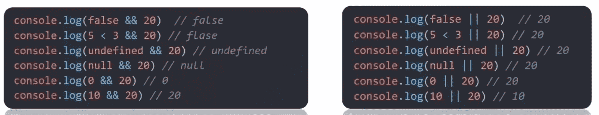

## 前言

> JavaScript是一种运行在客户端（浏览器）的编程语言，实现人机交互效果

 - 网页特效（监听用户的行为让网页做出对应的反馈）
 - 表单验证（针对表单数据的合法性进行判断）
 - 数据交互（获取后台的数据，渲染到前端）
 - 服务器编程（node.js）

**`JavaScript = ECMAScript + Web APIs(= DOM + BOM)`**

ECMAScript: JavaScript语言基础

- 规定了js基础语法核心知识
- 比如：变量、分支语句、循环语句等等

Web APIs

- DOM：页面文档对象模型。操作文档，比如对页面元素进行移动、大小、添加删除等操作
- BOM：浏览器对象模型。操作浏览器，比如页面弹窗、检测窗口高度、存储数据到浏览器等等

**以下整理`ECMAScript`部分的知识。**

## JS引入方式

JavaScript 程序不能独立运行，它需要被嵌入 HTML 中，然后浏览器才能执行 JavaScript 代码。
通过 `script` 标签将 JavaScript 代码引入到 HTML 中，有两种方式：

**1.内部方式**

在`</body>`上方，通过 `script` 标签包裹 JavaScript 代码

```html
<body>
  <!-- 内联形式：通过 script 标签包裹 JavaScript 代码 -->
  <script>
    alert('嗨，欢迎来传智播学习前端技术！')
  </script>
</body>
```

**2.外部方式**

如果`script`标签放在`<body>`开头，则会先加载 js 再加载 html 显示页面
此时如果js操作比较耗时，页面会卡住，得等一段时间才能加载出页面——除非要先发生某些事件再显示页面

一般将 JavaScript 代码写在独立的 `.js` 文件中，然后通过 `script` 标签的 `src` 属性引入，并且**此时 `script`标签内的代码会被忽略！**如下代码所示：

```javascript
// my.js
document.write('嗨，欢迎来传智播学习前端技术！')
```

```html
<body>
  <!-- 外部形式：通过 script 的 src 属性引入独立的 .js 文件 -->
  <script src="./js/my.js">
    // script内的代码全会被忽略掉！
  	alert(666);  
  </script>
</body>

等效于：<script src="./js/my.js"></script>
```

**3.内联（行内）方式**

直接在HTML标签代码内添加`js`代码

```html
<button onclick="alart('逗你玩~~')">点击我</button>
```

## 注释和结束符

**注释：**

- 单行注释（ctrl + /）：`//`
- 块(多行)注释（shift + alt + a）：`/* */`

**结束符：**

`;`代表一段代码的结束。多数情况下可以省略，使用回车`enter`替代。**二选一即可，不要混着用**

```js
  <script> 
      alert(1);
      alert(1)  // 这里应该也加上;的
      alert(2);
  </script>
```

## 输入输出语法

输出语法：

```javascript
# 文档输出内容
document.write('要输出的内容')
document.write('<h1>一级标题</h1>')

# 页面弹出警告框
alert('要输出的内容')

# 控制台输出，调试用
console.log('控制台打印')
```

输入语法：

```javascript
prompt('please input your name: ')
```

正常是按HTML文档流顺序执行JavaScript代码，其中 `alert()` 和 `prompt()` 会跳过页面渲染先被执行

**字面量**：在代码中表示固定值的数据

- 字符串字面量："Hello, world!"
- 数字字面量：42
- 布尔字面量：true 或 false
- 数组字面量：[1, 2, 3]
- 对象字面量：{ key: 'value' }


## 变量

变量可以理解为存储数据的`容器`，存储的内容可改变

```javascript
// 不提倡同时声明多个变量，如：let age = 18, uname = '张三'
// 变量的初始化 = 变量声明+变量赋值
let age = 18
let uname = '张三'
age = 19    // 更新变量

console.log(age, uname)

let uname = prompt('please input your name: ')
document.write(uname)

```

**命名规则**

- **不能用关键字**；只能由`下划线、数字、字母、$`组成，**数字不能开头**；字母**严格区分大小写**
- 起名要有意义；遵守**小驼峰命名法**，例：userName

let 和 var 的区别【现在都用let】

- var可以先使用再声明（不合理）
- var声明的变量可以重复声明，但let不允许多次声明同一个变量
- 其它问题：变量提升、全局变量、没有块级作用域等等

**常量**

```javascript
//常量声明的同时必须赋值，初始化后不允许重新赋值
const G = 9.8
console.log(G)
```

## 数据类型

JavaScript是弱数据类型的语言，**变量只有赋值之后才知道是什么数据类型**

- 基本数据类型

```
number，string，boolean，undefined，null
```

- 引用数据类型

```
object，array，function，date
```

**1.数字类型 Number**

可以是整数，小数，正数，负数

`NaN`代表一个计算错误，它是一个**不正确的**或者一个**未定义的**数学操作所得到的结果

任何对NaN的操作都会返回NaN（NaN具有粘性）

**2.字符串类型 String**

```js
let name = '中国联通';

let v1 = name.length;
let v2 = name[0];		// name.charAt(0);
let v3 = name.trim();	// 去除空白
let v4 = name.substring(1,2);	// 切片，范围：[前闭,后开)

console.log("pink老师很有'激情'")

document.write('我的名字叫' + uname + '.')	// 字符串拼接
document.write(`我的名字叫${uname}.`)	// 模板字符串★★★
```

**3.布尔类型boolean**

```javascript
let isCool = true
console.log(isCool)

// 布尔型字面量：true  false
```

**4.未定义类型undefined**

```javascript
// 只声明不赋值的情况下，变量默认值为undefined.一般很少将变量赋值为undefined
let num
console.log(num)
```
【技巧】在开发中，等待某个变量是否有数据从后端传送过来，可以通过检测它是不是`undefined`来判断

**5.空类型null**

```javascript
// undefined表示没有赋值，null表示赋值了但是 值为空

// 计算上的区别
undefined + 1 = NaN
null + 1 = 1

//obj里存对象，但是对象还没准备好，就可以先用null代替
```

**检测数据类型typeof：**

```js
let num1 = prompt('请输入第一个数：')
console.log(typeof num1)
```

## 类型转换

使用表单、prompt获取过来的数据默认是字符串类型的，不能直接进行运算，需要进行类型转换

**1.隐式转换**

某些运算符被执行时，系统内部自动将数据类型进行转换。**缺点：转换类型不明确，靠经验总结。**

- 任何数据 + **`字符串`** = **`字符串`**
- `+`作为正号，可以转换字符串为**数字型**；若字符串不全是数字，则转为`NaN`
- 除`+`以外的运算符，如`-*/`等都会把数据转换成**数字型**

```js
// 在控制台中，蓝色为数字，黑色为字符串
console.log(2 + 2)    // 4

console.log('pink' + 2) // `pink2`
console.log(2 + '2') // `22`

console.log(+'123')  // 123
console.log(+12)    // 12

console.log(2 - '2')  // 0  
```

**2.显式转换**

转换为数字型

```javascript
- Number(数据)
- +'字符串'

若字符串里有非数字，则转换失败，结果为NaN(Not a Number)
但NaN也是number类型的数据，代表 非数字

只能截取数字开头，还没那么智能能从中间截取数据
- parseInt(数据)	// 只保留整数
	console.log(parseInt('12.94px'))	// 12
	console.log(parseInt('abc12.94px'))	// NaN

- parseFloat(数据)	// 可以保留小数
	console.log(parseFloat('12.94px')) // 12.94
	console.log(parseFloat('abc12.94px')) // NaN
```

```javascript
//案例
// 1. 用户输入 prompt 得到字符串类型 要转换为 数字型
    let num1 = +prompt('请输入第一个数字：')
    let num2 = +prompt('请输入第二个数字：')
    // 2. 输出
    document.write(`
    	<p>两个数相加的和是:${num1 + num2}</p>
    `)
```

**综合案例**

```html
<style>
    h2 {
      text-align: center;
    }

    table {
      /* 合并相邻边框 */
      border-collapse: collapse;
      height: 80px;
      margin: 0 auto;
      text-align: center;
    }

    th {
      padding: 5px 30px;
    }

    table,
    th,
    td {
      border: 1px solid #000;
    }
</style>

<body>
  <h2>订单确认</h2>


  <script>
    // 1 用户输入
    let price = +prompt('请输入商品价格：')
    let num = +prompt('请输入商品数量：')
    let address = prompt('请输入收获地址：')
    // 2.计算总额
    let total = price * num
    // 3.页面打印渲染
    document.write(`
      <table>
          <tr>
            <th>商品名称</th>
            <th>商品价格</th>
            <th>商品数量</th>
            <th>总价</th>
            <th>收货地址</th>
          </tr>
          <tr>
            <td>小米青春版PLUS</td>
            <td>${price}元</td>
            <td>${num}</td>
            <td>${total}元</td>
            <td>${address}</td>
          </tr>
        </table>
    `)
  </script>
</body>
```


## 运算符

**赋值运算符**

- 包括：`=`、`+=`、`-=`、`*=`、`/=`、`%=`

**一元运算符**

- 作正号：`+'123'`
- 自增`++`、自减`--`
- `!`

**比较运算符**

- 包括：`<`、`>`、`<=`、`>=`、`==`、`!==`  

- 比较运算符也有隐式转换，`数字==字符`比较时，把字符型转化为**数字型**
- `==`只判断**值**

```js
console.log(2 == 2)    // true
console.log(2 == '2')  // true
console.log(2 != '2') // false
```

- `NaN`不等于任何数据，包括它自己。比较NaN的结果都是false

```js
console.log(NaN === NaN)  // false
```

- 字符串的比较，实际上是一个一个`比较ASCⅡ码`，如'aa'<'aac'

```js
console.log('a' < 'b') // true
console.log('aa' < 'ab') // true
console.log('aa' < 'aac') // true
```

- `===`同时判断**值**和**类型**是否相等

```js
console.log(2 === '2')  // false
console.log(undefined === null) // false
console.log(2 !== '2')  // true  
```

- 小数比较的时候先乘为整数再比较

```js
console.log(2.1 < 2.11) // true
```

**逻辑运算符**

- 与或非：`&&`，`||`，`!`


**运算符优先级**

| 优先级 | 运算符     | 顺序              |
| ------ | ---------- | ----------------- |
| 1      | 小括号     | ()                |
| 2      | 一元运算符 | ++  --  !         |
| 3      | 算术运算符 | 先* / % 后 + -    |
| 4      | 关系运算符 | >  >=  <  <=      |
| 5      | 相等运算符 | ==  !=  ===  !=== |
| 6      | 逻辑运算符 | 先&&后\|\|        |
| 7      | 赋值运算符 | =                 |
| 8      | 逗号运算符 | ,                 |

## 分支循环语句

### 分支语句

**1.if 语句**

除了`0`，所有数字都为真；除了`''`，所有字符串都为真

```js
// 1. 用户输入
let year = +prompt('请输入年份')
// 2. 判断输出
if (year % 4 === 0 && year % 100 !== 0 || year % 400 === 0) {
    alert(`${year}年是闰年`)
} else {
    alert(`${year}年是平年`)
}
```

```js
// 1. 用户输入
let score = +prompt('请输入成绩：')
// 2. 判断输出
if (score >= 90) {
    alert('成绩优秀，宝贝，你是我的骄傲')
} else if (score >= 70) {
    alert('成绩良好，宝贝，你要加油哦~~')
} else if (score >= 60) {
    alert('成绩及格，宝贝，你很危险~')
} else {
    alert('成绩不及格，宝贝，我不想和你说话，我只想用鞭子和你说话~')
}
```

**2.三元运算符**

`条件 ? 满足条件才执行的代码 : 不满足条件才执行的代码`

```js
3 > 5 ? 3 : 5   // 5   

let num1 = +prompt('请您输入第一个数：')
let num2 = +prompt('请您输入第二个数：')
num1 > num2 ? alert(`最大值是: ${num1}`) : alert(`最大值是: ${num2}`)
```

**案例：**小于10的数字，前面补0（返回的都是string类型）

```javascript
let num1 = prompt('请输入一个数字：')
num1 = num1 < 10 ? 0 + num1 : num1

let num2 = +prompt('请输入一个数字：')
num2 = num2 < 10 ? '0' + num2 : `${num2}`

console.log(num1)
console.log(num2)
```

**3.switch 语句**

```javascript
// 1.用户输入  2个数字 +  操作符号  + - *  / 
let num1 = +prompt('请您输入第一个数字:')
let num2 = +prompt('请您输入第二个数字:')
let sp = prompt('请您输入 + - * / 其中一个:')
// 2. 判断输出
switch (sp) {
    case '+':
        alert(`两个数的加法操作是${num1 + num2}`)
        break
    case '-':
        alert(`两个数的减法操作是${num1 - num2}`)
        break
    case '*':
        alert(`两个数的乘法操作是${num1 * num2}`)
        break
    case '/':
        alert(`两个数的除法操作是${num1 / num2}`)
        break
    default:
        alert(`你干啥咧，请输入+-*/`)
} 
```

### 循环语句

**1.do-while循环**

**2.while循环**

```javascript
while(循环条件) {
    要重复执行的代码(循环体)
}
// 三要素：变量起始值，终止条件，变量变化量
```

```js
while(true) {
    let res = prompt('1 + 1 = ?')
    if(res === '2')
        break
}
```

循环退出

- break：退出整个循环
- continue：结束本轮循环，进入下一轮循环

**断点调试**

运行网页，按F12打开开发者工具，找到Resources，点击html文件，点击某行代码前的序号设置断点

然后刷新网页，代码会执行到断点处。右侧scope为当前变量的值，watch可以添加需要监视的变量，

可以点击某按钮执行下一句

**综合案例：**ATM取款机

```js
// 1. 开始循环 输入框写到 循环里面
// 3. 准备一个总的金额
let money = 100
while (true) {
    let re = +prompt(`
        请您选择操作：
        1.存钱
        2.取钱
        3.查看余额
        4.退出
    `)
    // 2. 如果用户输入的 4 则退出循环， break  写到if 里面，没有写到switch里面， 因为4需要break退出循环
    if (re === 4) {
        break
    }
    // 4. 根据输入做操作
    switch (re) {
        case 1:
            // 存钱
            let cun = +prompt('请输入存款金额')
            money = money + cun
            break
        case 2:
            // 存钱
            let qu = +prompt('请输入取款金额')
            money = money - qu
            break
        case 3:
            // 存钱
            alert(`您的银行卡余额是${money}`)
            break
    }
}
```

**for循环**

```
for(变量起始值;终止条件;变量变化量){
    // 循环体
}
```

```js
// 外层循环打印 第 n 天
for (let i = 1; i <= 3; i++) {
    document.write(`第${i}天<br>`)
    // 里层循环打印 第几个单词
    for (let j = 1; j <= 5; j++) {
        document.write(`记住了第${j}个单词<br>`)
    }
}
```

## 数组

- **数组元素插入和删除**

```javascript
let arr = ['刘德华', '张学友', '黎明', '郭富城', 'pink老师', 10]
console.log(arr[4])		// pink老师
console.log(arr.length) // 6

// 返回值是 新数组的长度
console.log(arr.push('成龙'))		// 在数组尾插入，返回7
console.log(arr.unshift('成龙'))	// 在数组头插入，返回8

// 返回值是 删除的元素的值
arr.pop()		// 删除数组最后一个元素
arr.shift()		// 删除数组第一个元素并返回
arr.splice(start, deleteCount)	// 以下标strat为起点删除deleteCount个元素
```

- **数组排序—— sort()**

```javascript
// arr.sort()   // 排序

let arr = [4, 2, 5, 1, 3]

arr.sort(function (a, b) {  // 升序写法 [1, 2, 3, 4, 5]
    return a - b
})

arr.sort(function (a, b) {  // 降序写法 [5, 4, 3, 2, 1]
    return b - a
})

console.log(arr)
```

- **迭代数组—— map()**

```javascript
// arr.map()	// 迭代数组，返回值为新数组

const arr = ['red', 'green', 'blue']
const newArr = arr.map(function(ele, index) {
    console.log(ele)		// 数组元素
    console.log(index)		// 数组索引号
    return ele + '颜色'
})

console.log(newArr) // ['red颜色', 'green颜色', 'blue颜色']
```

- **数组元素拼接—— join()**

```javascript
// arr.join()	// 把数组中的所有元素以某分隔符连接成一个字符串

const arr = ['red颜色', 'green颜色', 'blue颜色']
console.log(arr.join('-'))      // red颜色-green颜色-blue颜色
```

- **遍历数组—— forEach()**

```javascript
const arr = ['red', 'green', 'blue']
const result = arr.forEach(function(item, index) {  // 加强版for循环，适合于遍历数组对象，越复杂越适合
    console.log(item)	// 当前数组元素,item必写
    console.log(index)	// 当前索引号
    // 只遍历不返回值
})
```

- **筛选数组—— filter()**

```javascript
const arr = [10, 20 30]

const newArr = arr.filter(item => item >=20)    // 返回数组，包含符合条件的所有元素；都不符合则返回空数组
console.log(newArr)             // 筛选返回的是新数组，不会影响原数组
```

- **累计器—— reduce()**

```javascript
// 返回累计处理的结果，经常用于求和等
arr.reduce(function(){}, 起始值)
arr.reduce(function(上一次值，当前值){}，初始值)
```

```javascript
const arr = [1, 5, 8]

const num1 = arr.reduce((prev, current) => prev + current)      // 14
const num2 = arr.reduce((prev, current) => prev + current, 10)	// 24
```

**更多方法可以看JS进阶—day2—内置构造函数—Array**

## 函数

命名规范

- 和变量名基本一致
- 尽量小驼峰式命名
- 前缀应为动词：`can, has, is, get, set, load`

**具名函数**

```
function 函数名(参数列表) {
    函数体
}
```

```js
/* 如果没设置形参默认值，也没给实参，那么形参值默认是undefined */
function getSum(start = 0, end = 1) {
    let sum = 0
    for(let i = start; i <= end; i++) {
    	sum += i
    }
    console.log(sum)
}
```

```javascript
function getArrSum(arr = []) {
    let sum = 0
    for(let i = 1; i <= arr.length; i++) {
        sum += i
    }
    return sum;
}

getArrSum()     // 0
```

**匿名函数**

**1.函数表达式**

```javascript
let fn = function(x, y) {
    // 函数体
    console.log(x + y)
}
```

具名函数的调用可以写到任何位置；**匿名函数**必须**先声明函数表达式，后调用。**

**2.立即执行函数**

作用：防止被全局变量污染

规定：立即执行函数开头或者结尾必须加  `;` 将它们分开

```
(function () { console.log(11) })();

(function () { console.log(11) }());
```

- `function(x, y)`：这是一个**函数的声明**，它定义了一个函数，但并没有立即执行它
- `function(x, y) { console.log(x + y); }`：这是一个**函数表达式**，定义了一个匿名函数并包含了函数体。，也没有立即执行它
- `function(x, y) { console.log(x + y); }(1, 3)`：这是一个**立即调用函数表达式**，在声明函数后，紧接着用 (1, 3) 立即调用它。这种写法在创建函数后立即执行，传递参数 1 和 3 给函数。但这种写法语法错误。
- `(function(x, y) { console.log(x + y); }(1, 3))`：同上。只是加了外层括号才不会导致语法错误。最外部的括号是为了将函数声明转换为函数表达式，告诉 JavaScript 解释器这是一个表达式而不是函数声明。
- `function(x, y) { console.log(x + y); }(1, 3)`：创建了一个匿名函数表达式，给它传递参数并立即调用

```js
(function(x, y){
    console.log(x + y)
})(1, 2);     // 结果为3
```

```js
(function (x, y) {
        console.log(x + y)
    }(1, 3));   // 结果为4
```

**案例：**秒数转换时分表

```javascript
let second = +prompt("请输入秒数")

function getTime(t) {
    let h = parseInt(t / 60 / 60 % 24)
    let m = parseInt(t / 60 % 60)
    ls = parseInt(t % 60)

    h = h < 10 ? '0' + h : h
    m = m < 10 ? '0' + m : m
    s = s < 10 ? '0' + s : s

    return ` 相当于${h}时${m}分${s}秒`
}

let str = `${second}秒 ` + getTime(second)
document.write(str)
```


注意局部变量和全局变量的区别

**作用域的特殊情况：如果函数内部，变量没有声明，直接赋值，也当全局变量看**

## 逻辑中断

**1.逻辑运算符里的短路**

- 短路：只存在于 && 和 || 中，当满足一定条件会让右边代码不执行

| 符号 | 短路条件          |
| ---- | ----------------- |
| &&   | 左边为false就短路 |
| \|\| | 左边为true就短路  |

- 原因：通过左边就能得到整个式子的结果，无需判断右边

```javascript
// &&遇到false就中断，||遇到true就中断

let age = 18	
console.log(false && age++)	// 代码先看左边为false，表达式为false，则右边直接不执行
console.log(age)	// 18
	
console.log(true || age++)	// 代码先看左边为true，表达式为true，则右边直接不执行
console.log(age)	// 18
```

```javascript
console.log(11 && 22)	// 判断到22才知道表达式为真，则返回最后一个值，22

console.log(11 || 22)	// 看到11就知道表达式为真，则直接返回第一个真值，11
```

```javascript
function fn(x, y) {
    x = x || 0
    y = y || 0
    console.log(x + y)
}
fn(1, 2)	// 3
fn()		// 0,如果没给实参，则形参为undefined当做0看待
```



**2.转换为Boolean型**

> 显式转换

```javascript
// 就这几个为假。其他的都为真

console.log(Boolean(0))
console.log(Boolean(''))
console.log(Boolean(undefined))
console.log(Boolean(full))
console.log(Boolean(NaN))
```

> 隐式转换

- 字符串加法结果都为字符串：'' + 1 = '1'
- 减法- 只能用于数字，它会使**空字符串**`''`转换为0
- null 经过数字转换之后会变为0
- undefined 经过数字转换后变为NaN

```
null + 3 --> 3
undefined - 3 --> NaN
'' - 1 --> -1
'pink' - 1 --> NaN

null == undefined --> true
null === undefined --> false
```

## 对象

对象是一个数据类型，是无序数据的集合，是对某个事物的描述

```javascript
let 对象名 = {
    属性名: 属性值,
    方法名: 函数
}

let 对象名 = new Object()

// 属性名一般可以不用""或''包着，但是遇到特殊符号如空格、中横线等情况需要加上
```

```javascript
let obj = {
    uname: 'pink',
    age: 18,
    gender: 'male'
    'home-address': 'Fuzhou.Fujian'
}

console.log(obj.age)    // 查询属性 方法（1）
obj.age = 23		// 重新赋值
obj.height = 178	// 新增属性
delete obj.height	// 删除属性

console.log(obj['home-address'])	// 查询属性 方法（2）
```

如果**属性名包含特殊字符**则使用时会出错，所以属性名用`''`包住，用`对象名['属性名']`表示对象的属性 ，避免报错

【技巧】null为一个空对象，先将对象设为null，将来要用了再替换掉：`let obj = null`

**方法**

```javascript
let person = {
    name: 'andy',
    sayHi: function() {
        document.write('hi~~')
    }
}

person.sayHi()
```

**遍历对象**

```javascript
for (let k in obj) {        // 遍历对象用for in
    console.log(k)          // 这里的k是字符串
    console.log(obj.k)      // 相当于obj.'xxx'，这会出错的
    console.log(obj[k])     // 正确写法
}
```

**内置对象**

JS内部提供的`对象`，包含**各种属性和方法**给开发者调用

```markdown
— Math

    random	生成[0,1)之间的随机数
    ceil	向上取整
    floor	向下取整
    round	四舍五入
    max、min 最大值最小值
    pow		幂运算
    sqrt	求平方根运算
    abs		绝对值
    ...Math对象在线文档

```

```javascript
console.log(Math.round(-1.5))	// 值为-2;以绝对值四舍五入再加符号

Math.floor(Math.random() * (10 + 1))	// 生成[0，10]之间的随机数
Math.floor(Math.random() * (5 + 1)) + 5	// 生成[5，10]之间的随机数

let arr = ['red', 'green', 'blue']      // 数组的随机下标，让 random * arr.length 就行
let random_i = Math.floor(Math.random() * arr.length)
console.log(arr[random_i])

function getRandom(N, M) {		// 生成[N，M]之间的随机数
    return Math.floor(Math.random() * (M - N + 1))	+ N	
}

```

**案例：**获取随机颜色

```css
<style>
    div {
        height: 300px;
        width: 300px;
    }
</style>
```

```html
<body>
    <div></div>

    <script>
        // 1. 自定义一个随机颜色函数
        function getRandomColor(flag = true) {
            if (flag) {
                // 3. 如果是true 则返回 #ffffff
                let str = '#'
                let arr = ['0', '1', '2', '3', '4', '5', '6', '7', '8', '9', 'a', 'b', 'c', 'd', 'e', 'f']
                // 利用for循环随机抽6次 累加到 str里面
                for (let i = 1; i <= 6; i++) {
                    // 每次要随机从数组里面抽取一个  
                    // random 是数组的索引号 是随机的
                    let random = Math.floor(Math.random() * arr.length)
                    str += arr[random]
                }
                return str
            } else {
                // 4. 否则是 false 则返回 rgb(255,255,255)
                let r = Math.floor(Math.random() * 256)  
                let g = Math.floor(Math.random() * 256)  
                let b = Math.floor(Math.random() * 256)  
                return `rgb(${r},${g},${b})`
            }
        }
        const div = document.querySelector('div')
        div.style.backgroundColor = getRandomColor()
    </script>
</body>
```

## 数据类型存储注意点

在**基本数据类型**中，变量指向栈中的某个空间

```javascript
let x = 10
let y = x
y = 20
console.log(y)
// 此时x的值还是10，因为y=x只是把x的存储空间内的值拷贝给了y所指的存储空间，即10，但y的指向还是自己的空间，
// 所以y=20时还是改变y自己指向的空间内的值，与x无关
```

在**引用数据类型**中，变量指向栈中的某块存储空间.其中的值为堆的某块空间的首地址。而这块堆空间里面存的是这个对象的内容。例如：数组，对象，函数

```javascript
let obj1 = {
    age: 18
}
let obj2 = obj1
obj2.age = 20
console.log(obj1.age)
// 在堆中存放obj1对象的内容，obj1在栈中的一块空间内存储着这个堆的首地址
// 然后obj2=obj1 即obj1把堆的首地址拷贝给obj2,此时两个栈空间内存的值相同,指向同一个堆
// 因此obj2改变了该堆的age，那么obj1也指向这个堆，所以它的obj1.age也是20
```

